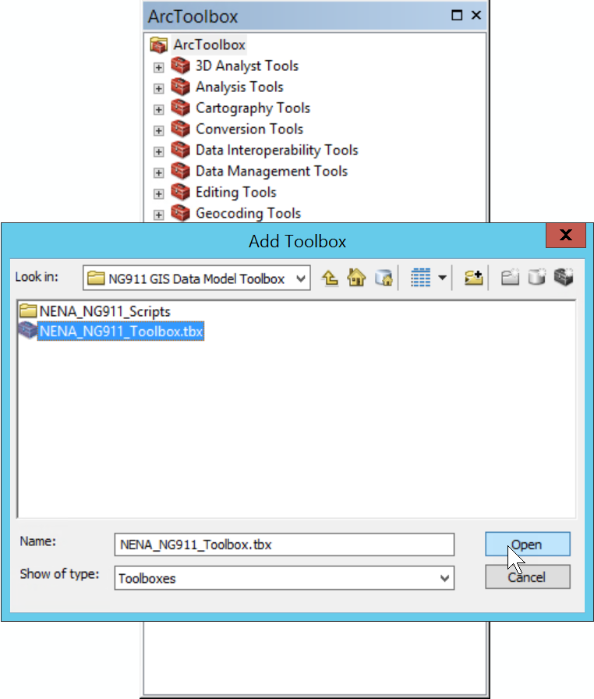

# Esri GeoDatabase Template

The material within this folder contains both a template Esri File Geodatabase
(FGDB) that may be used directly and an ArcGIS Toolbox with associated Python 
scripts to generate a new FGDB. The ArcGIS Toolbox was used by the DS-GIS 
Template working group to generate the example FGDB.

The NENA GIS Data Model template is designed for organizations who implement the 
Esri ArcGIS Platform but may also be modified by organizations for use in other 
GIS platforms.

---

## Table of Contents

* [Folders and Files](#folders-and-files)
* [Getting Started](#getting-started)
  * [Dependencies](#dependencies)
  * [Using the pre-built NG9-1-1 GIS Template](#using-the-pre-built-ng9-1-1-gis-template)
  * [Using the ArcGIS Toolbox](#using-the-arcgis-toolbox)
    * [ArcGIS Desktop 10.8.x Instructions](#arcgis-desktop-108x-instructions)
    * [ArcGIS Pro Instructions](#arcgis-pro-instructions)
    * [Create NG9-1-1 File Geodatabase Tool](#create-ng9-1-1-file-geodatabase-tool)
* [Modifying the Python Scripts](#modifying-the-python-scripts)
  * [Domain (DOMAIN) Dictionary Schema](#domain-domain-dictionary-schema)
  * [Feature Class (FEATURE_CLASSES) Dictionary Schema](#feature-class-feature_classes-dictionary-schema)
  * [Table (TABLES) Dictionary Schema](#table-tables-dictionary-schema)
  * [Relationship (RELATES) Dictionary Schema](#relationship-relates-dictionary-schema)
* [Help](#help)
* [Change Log](#change-log)
* [Contributors](#contributors)
* [Acknowledgements](#acknowledgements)

---

## Folders and Files
* [archive](.archive)
  * [v1](.archive/v1) - Folder containing the version 1 Data Model template and files.
* [NENA_NG911_Scripts](NENA_NG911_Scripts)
  * [schema](schema) - Folder containing the NENA GIS Data Model schema which is 
    processed by [create_n911_fgdb.py](NENA_NG911_Scripts/create_ng911_fgdb.py).
    * [schema_fgdb_v2.py](NENA_NG911_Scripts/schema_fgdb_v2.py) - Python file 
      containing the NENA GIS Data Model as dictionaries.
  * [create_n911_fgdb.py](NENA_NG911_Scripts/create_ng911_fgdb.py) - Python script 
    used by the NENA GIS Data Model File geodatabase.
* [NENA_NG911_Toolbox.tbx](NENA_NG911_Toolbox.tbx) - ArcGIS Toolbox which supports 
  both ArcGIS Desktop 10.8 and ArcGIS Pro.
* [README.md](README.md) - This document.

---

## Getting Started

### Dependencies

* Operating System: Windows 10 (or later)
* GIS Software: ArcGIS 10.2 (or later) AND/OR ArcGIS Pro 1.x (or later)
* GIS Software Licensing Level: Standard or Advanced

*Note: This has been only testing in ArcGIS Desktop 10.8.1 and ArcGIS Pro v2.9.x 
and 3.0.x. We are aware of issues with ArcGIS Desktop 10.5.x where the Create 
NG911 FGDB tool does not display in the ArcGIS Toolbox.

If you run into issues, run the script, please report a Bug in the Issues, 
describe the issue that you had, screenshots are great, and please let us 
know the version and licensing level of ArcGIS Desktop you encountered the issue 
within.*

### Using the pre-built NG9-1-1 GIS Template

If only interested in the template FGDB itself, download and unzip 
[NG911_GIS_Template.gdb.zip](NG911_GIS_Template.gdb.zip). This contains a 
pre-built NENA GIS Data Model template file geodatabase. The FGDB can be placed 
on the target machine and connected to using a suitable GIS application.

### Using the ArcGIS Toolbox

If you are interested in creating the NENA GIS Data Model template from the 
supplied ArcGIS Toolbox follow the instructions appropriate to your version 
of ArcGIS Desktop. 

*NOTE: You must download or clone the Git repository to your local computer 
before proceeding.*

#### ArcGIS Desktop 10.8.x Instructions

* From the **Start** menu, open **ArcMap**
* Open ArcToolbox by going to **Geoprocessing** > **ArcToolbox** 
  
* When **ArcToolbox** opens, right-click in **ArcToolbox** and select **Add Toolbox...** 
  
* In the **Add Toolbox" file dialog, navigate to where the Git repository was 
  downloaded, select **NENA_NG911_Toolbox.tbx**, and click **Open**. 
  
* In **ArcToolbox**, expand the **NENA NG9-1-1 Toolbox** 
  
* Double-click **Create NG9-1-1 File Geodatabase (ArcMap)** to run the geoprocessing tool. 
   
  

#### ArcGIS Pro Instructions

* From the **Start** menu, open **ArcGIS Pro**
* Create a new project using the **Catalog** template
* In the **Catalog** pane, right-click on **Toolboxes** and select **Add Toolbox**. 
  
* In the **Add Toolbox" file dialog, navigate to where the Git repository was 
  downloaded, select **NENA_NG911_Toolbox.tbx**, and click **Open**. 
  
* In **ArcGIS Pro** and double-click again on the **NENA_NG911_Toolbox.tbx** 
  
* Double-click **Create NG9-1-1 File Geodatabase (ArcMap)** to run the geoprocessing tool. 
  

#### Create NG9-1-1 File Geodatabase Tool

The Create NG9-1-1 File Geodatabase tool uses the same input variables in both 
ArcGIS Desktop 10.8.x and ArcGIS Pro. In tests, it takes approximately seven to nine 
minutes to build out the complete file geodatabase. 

* **Destination Folder** - Select a destination folder for the creation of the file geodatabase.
* **File Geodatabase Name** - The name of the output file geodatabase. A file type extension is not required and will be added automatically.
* **GDB Version** - The version for the new geodatabase.
  * CURRENT - Creates a geodatabase compatible with the currently installed version of ArcGIS.
  * 10.0 - Creates a geodatabase compatible with ArcGIS version 10
* **Spatial Reference** - The spatial reference of the output feature classes. The default is WGS 1984 per NENA-STA-006.2-2002.
* **Allow Overwrite** - Allows existing file geodatabase in the destination folder to be overwritten if checked. 

To monitor the progress in ArcGIS Pro, Click **Run** to run the script. 
Click **View Details** to see the progress details. 

## Modifying the Python Scripts

The `schema_fgdb_v2.py` file contains four dictionaries containing all the 
information to create domains (DOMAINS), feature classes (FEATURE_CLASSES), 
tables (TABLES), relationships (RELATES), and populate initial data used by 
the `create_ng911.fgdb.py` script from from the **NENA_NG911_Toolbox**.

This schema may be modified by organizations to fit their individual needs 
and requirements by modifying the `schema_fgdb_v2.py` or easily incorporate into 
their own business processes.

### Domain (DOMAIN) Dictionary Schema

The domain dictionary is based on Esri's ArcPy 
[Create Domain (Data Management)](https://pro.arcgis.com/en/pro-app/latest/tool-reference/data-management/create-domain.htm) 
command and contains the following keys:

* `domain_name`: The name of the domain that will be created.
* `domain_description`: The description of the domain that will be created.
* `field_type`: Specifies the type of attribute domain that will be created. 
   For more information please see the `field_type` parameter at 
   [Create Domain (Data Management)](https://pro.arcgis.com/en/pro-app/latest/tool-reference/data-management/create-domain.htm).
* `domain_type`: Specifies the domain type that will be created. For more 
   information please see the `field_type` parameter at 
   [Create Domain (Data Management)](https://pro.arcgis.com/en/pro-app/latest/tool-reference/data-management/create-domain.htm).
* `values`: Specifies any initial values, as a dictionary, applied to the domain. 
  * Acceptable values are `None`, `"CODED"`, and `"RANGE"`. 
  * `"CODED"` values, the dictionary key is equivalent to `code` parameter of 
     [Add Coded Value To Domain (Data Management)](https://pro.arcgis.com/en/pro-app/latest/tool-reference/data-management/add-coded-value-to-domain.htm) 
     and the dictionary value is equivalent to the `code_description` parameter. 
  * `"RANGE"` values, the dictionary key is equivalent to `min_value` parameter of 
     [Set Value For Range Domain (Data Management)](https://pro.arcgis.com/en/pro-app/latest/tool-reference/data-management/set-value-for-range-domain.htm) 
     and the dictionary value is equivalnt to the `max_value` parameter.

### Feature Class (FEATURE_CLASSES) Dictionary Schema

The feature class dictionary is based on Esri's ArcPy 
[Create Feature Class (Data Management)](https://pro.arcgis.com/en/pro-app/latest/tool-reference/data-management/create-feature-class.htm) 
command and the dictionary contains the following keys:

* `out_name`: The name of the feature class to be created.
* `out_alias`: The alias name of the feature class to be created.
* `geometry_type`: Specifies the geometry type of the feature class.
* `has_m`: Specifies whether the feature class contains linear measurement values (m-values).
* `has_z`: Specifies whether the feature class contains elevation values (z-values).
* `fields`: Specifies the fields, as a list of lists, to apply to the feature class. 
  * Each field is added using the following list template  
    `[field_name, field_type, field_precision, field_scale, field_length, field_alias, field_is_nullable, field_is_required, field_domain]`.  
    See the ArcPy command 
    [Add Field (Data Management)](https://pro.arcgis.com/en/pro-app/latest/tool-reference/data-management/add-field.htm) for the appropriate values.

### Table (TABLES) Dictionary Schema

The tables dictionary is based on Esri's ArcPy 
[Create Table (Data Management)](https://pro.arcgis.com/en/pro-app/latest/tool-reference/data-management/create-table.htm) 
command and dictionary contains the following keys:

* `out_name`: The name of the feature class to be created.
* `out_alias`: The alias name of the feature class to be created.
* `fields`: Specifies the fields, as a list of lists, to apply to the table.   
  * Each field is added using the following list template  
    `[field_name, field_type, field_precision, field_scale, field_length, field_alias, field_is_nullable, field_is_required, field_domain]`.  
    See the ArcPy command 
    [Add Field (Data Management)](https://pro.arcgis.com/en/pro-app/latest/tool-reference/data-management/add-field.htm) for the appropriate values.

### Relationship (RELATES) Dictionary Schema

The relationship dictionary is based on Esri's ArcPy 
[Create Relationship Class (Data Management)](https://pro.arcgis.com/en/pro-app/latest/tool-reference/data-management/create-relationship-class.htm) 
command. The schema keys are identical to the parameters, please visit the 
documentation for more information.

---

## Help

For assistance please visit https://www.nena.org/page/DataStructures where 
contact information for the leadership of the Data Structures Committee can be found.  

---

## Change Log

* v2.0
    * Updated for [NENA-STA-006.2-2022](https://www.nena.org/page/NG911GISDataModel)
    * Various bug fixes and optimizations
    * See [commit change]() or See [release history]()
* v1.0
    * Based on [NENA-STA-006.1.1-2020]()
    * Initial Release

---

## Contributors

* Jason Horning, ENP
* Tom Neer

---

## Acknowledgements

Trademarks provided under license from Esri. 
Other companies and products mentioned are trademarks of their respective owners. 
