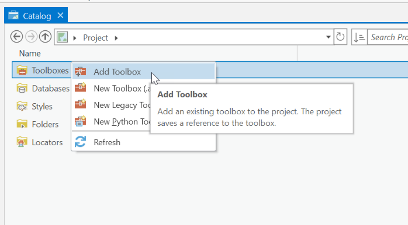
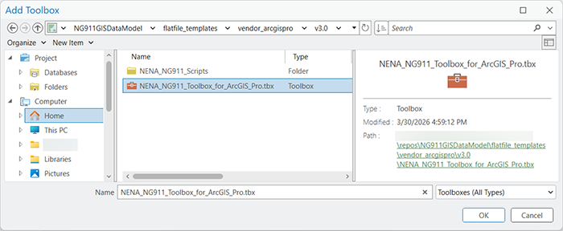
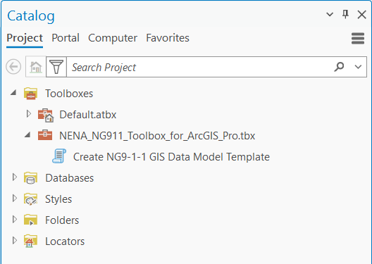
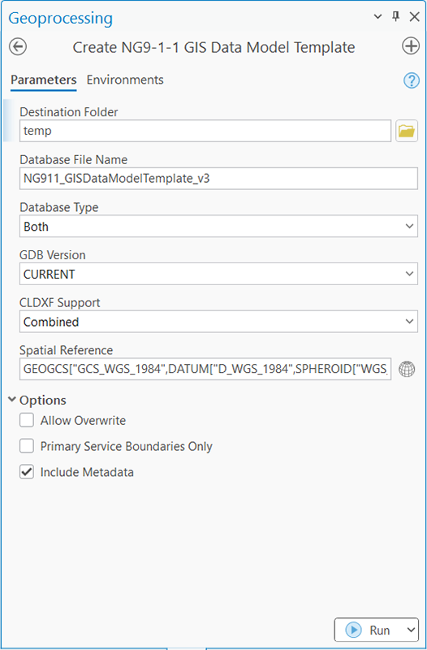
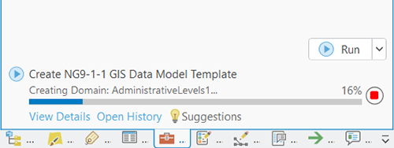
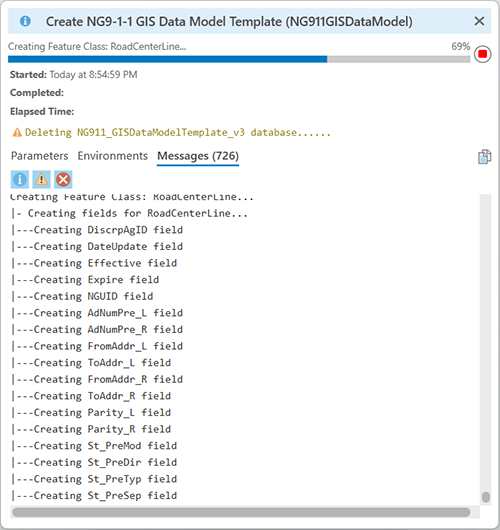

# Flat-File GIS Data Model Template

This folder contains Python scripts and ArcGIS Pro Toolbox capable of creating NENA NG9-1-1 GIS Data Model-compliant templates in both File geodatabase and GeoPackage formats.

---

* [Folders and Files](#folders-and-files)
* [Getting Started](#getting-started)
  * [Dependencies](#dependencies)
  * [Using the ArcGIS Pro Toolbox](#using-the-arcgis-pro-toolbox)
  * [Create NG9-1-1 GIS Data Model Template Tool](#create-ng9-1-1-gis-data-model-template-tool
* [Known Issues](#known-issues)
* [Help](#help)
* [Change Log](#change-log)
* [Acknowledgements](#acknowledgements)

---

## Folders and Files

* [NENA_NG911_Scripts](NENA_NG911_Scripts): Folder containing Python scripts and libaries that generate various derivative products from the flat-file schema.
  * [util](NENA_NG911_Scripts/util) - Folder containing Python libraries used by NENA scripts.
    * [constants.py](NENA_NG911_Scripts/util/constants.py) - Constants used by [create_ng911_template.py](NENA_NG911_Scripts/create_ng911_template.py)
    * [logger.py](NENA_NG911_Scripts/util/logger.py) - Python library that 
      creations and manages log files for [create_ng911_template.py](NENA_NG911_Scripts/create_ng911_template.py).
  * [create_ng911_template.py](NENA_NG911_Scripts/create_ng911_template.py) - Python script that parses the [flatfile_schema_v3.yaml](../../schema/v3.0/flatfile_schema_v3.yaml) file to convert the YAML defintion into File geodatabase and/or GeoPackage formats.
  * [run_schema_report.py](NENA_NG911_Scripts/run_schema_report.py) - Python script that parses the [flatfile_schema_v3.yaml](../../schema/v3.0/flatfile_schema_v3.yaml) file to convert the YAML definition into a Microsoft Excel spreadsheet for simplified review and validation.
* [NENA_NG911_Toolbox_for_ArcGIS_Pro.tbx](NENA_NG911_Toolbox_for_ArcGIS_Pro.tbx) - ArcGIS Pro Toolbox.
* [README.md](README.md) - This document.

---

## Getting Started

### Dependencies

* Operating System: Windows 10 (or later)
* GIS Software: ArcGIS Pro 3.0 (or later)
* GIS Software Licensing Level: Any

*If you run into issues running the script, please report a bug in the [Issues](https://github.com/NENA911/NG911GISDataModel/issues), describe the issue that you had, screenshots are great, and please let us know the ArcGIS Pro and Operating System version you encountered the issue within.*

### Using the ArcGIS Pro Toolbox

If you are interested in creating the NENA GIS Data Model template from the supplied ArcGIS Pro Toolbox, you must download/clone the Git repository to your local computer before proceeding.

ArcGIS Pro Instructions

* From the **Start** menu, open **ArcGIS Pro**
* Create a new project using the **Catalog** template
* In the **Catalog** pane, right-click on **Toolboxes** and select **Add Toolbox**. 
  
* In the **Add Toolbox** file dialog, navigate to where the Git repository was downloaded, select **NENA_NG911_Toolbox_for_ArcGIS_Pro.tbx**, and click **Open**. 
  
* Expand the **NENA_NG911_Toolbox_for_ArcGIS_Pro.tbx**
  
* Double-click **Create NG9-1-1 GIS Data Model Template** to run the geoprocessing tool. 
  

#### Create NG9-1-1 GIS Data Model Template Tool

The **Create NG9-1-1 GIS Data Model Template** tool takes approximately seven to nine minutes to build out the complete database(s). 

* **Destination Folder** - Select a destination folder for the creation of the file geodatabase.
* **Database File Name** - The name of the output file database. A file type extension is not required and will be added automatically.
* **Database Type** - The type of geospatial database to be created.
  * Both - Creates both a File geodatabase and GeoPackage format.
  * File geodatabase (.gdb) - Creates only a File geodatabase format.
  * GeoPackage (.gpkg) - Creates only a GeoPackage format.
* **GDB Version** - The version for the new file geodatabase.
  * CURRENT - Creates a geodatabase compatible with the currently installed version of ArcGIS.
  * 10.0 - Creates a geodatabase compatible with ArcGIS version 10.
* CLDXF Support - Allows the user to define the CLDXF variant or both.
  * Combined - Outputs both the CLDXF-CA and CLDXF-US fields.
  * CLDXF-CA - Outputs only the CLDXF-CA fields.
  * CLDXF-US - Outputs only the CLDXF-US fields.
* **Spatial Reference** - The spatial reference of the output feature classes. The default is WGS 1984 per NENA-STA-006.3-2026.
* **Allow Overwrite** - Allows existing database files in the destination folder to be overwritten, if checked. 
* **Primary Service Boundaries Only** - Create only the primary Service Boundaries (PsapPolygon, FirePolygon, PolicePolygon, and EmsPolygon) or includes all primary Service Boundaries and the Service Boundaries template layer.
* **Import Metadata** - Enables (checked) or disables (un-checked) the default metadata.

Click **Run** to run the script.

Click **View Details** to see the progress details. 

---

## Known Issues

* **Python Script RuntimeError** [Issue [#29](https://github.com/NENA911/NG911GISDataModel/issues/29)] - When running as standalone Python script there are a couple of scenarios where the script will fail and immediately crash on the `import arcpy` line if the user is not signed in to ArcGIS Pro or isn't utilizing an offline Pro license. A workaround is provided in Issue [#29](https://github.com/NENA911/NG911GISDataModel/issues/29), however, it was decided not to include this as it is a vendor issue, not an issue with the actual Python script.
* **File Geodatabase Fails to completely delete** - This appears to be an Esri bug associated with Windows 11 Home and its use of OneDrive. OneDrive appears to lock the parent folder. Moving from the Desktop folder to c:\temp or other folder not managed by OneDrive is a recommended workaround for the issue. For more information, please see https://support.esri.com/en-us/knowledge-base/problem-arcgis-pro-and-cloud-storage-services-000025605.

---

## Help

For assistance not provided within this repositories documentation, please visit https://www.nena.org/page/DataStructures where contact information for the leadership of the Data Structures Committee can be found.  

---

## Change Log

* v3.0
  * Initial Release

---

## Acknowledgements

Trademarks provided under license from Esri. Other companies and products mentioned are trademarks of their respective owners. 