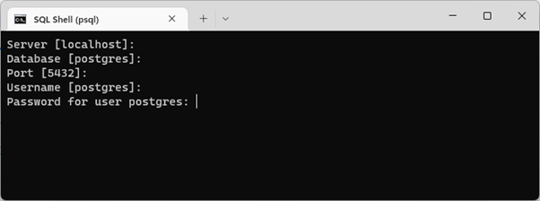
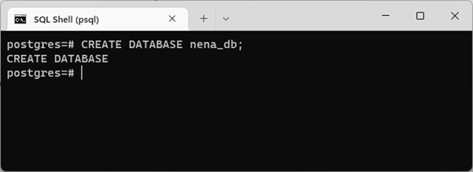
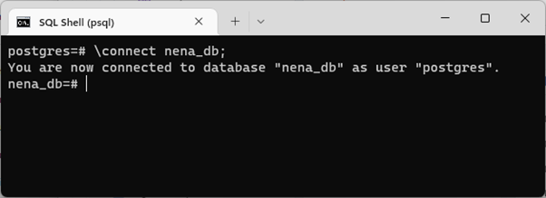
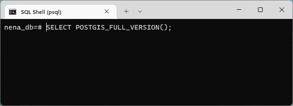
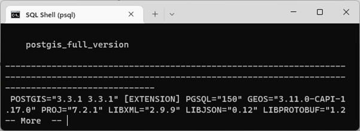
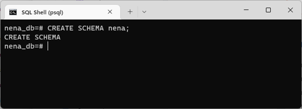
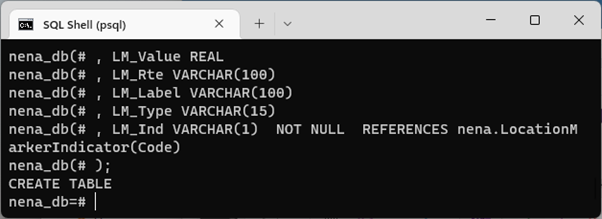
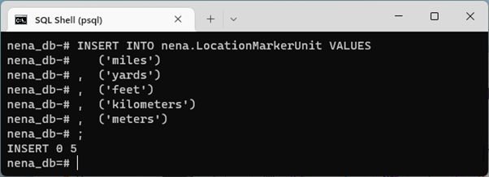

# PostgreSQL/PostGIS GIS Data Model Template

This documentation provides the step-by-step instructions to create, deploy, 
backup, and restore the NG9-1-1 Data Model Template for PostgreSQL/PostiGIS, 
prepared by the NENA Data Model Working Group. This Data Model is designed for 
an open source PostgreSQL/PostGIS database but can be adapted for other platforms.

*[2022-11-16] NOTE: This documentation is still under development.*

---

## Table of Contents

* [Getting Started](#getting-started)
  * [Dependencies](#dependencies)
  * [Creating the database](#creating-the-database)
  * [Installing PostGIS extensions](#creating-a-schema-optional)
  * [Changing permissions](#changing-permissions-optional)
  * [Tuning PostgreSQL](#tuning-postgresql-optional)
* [Deploying the Data Model Template](#deploying-the-data-model-template)
  * [Data Model Template SQL Script](#data-model-template-sql-script)
  * [Deploying the Data Model Initial Data](#deploying-the-data-model-initial-data)
* [Backing up the Database](#backing-up-the-database)
* [Restoring the Database](#restoring-the-database)
* [Change Log](#change-log)
* [Contributors](#contributors)

---

## Getting Started

The following section covers the creation of the database and database 
management best practices. With the exception of the database creation, 
other topics of this section are recommended, but optional.

This section does not cover the specific installation of any software or 
the database management tool is the choice of the user. 

### Dependencies

In addition to the dependencies below, it is assumed that the user has a 
fundamental understanding of relational database installation and management.

* **[PostgreSQL](https://www.postgresql.org/download/)** v12 or later
  * Earlier versions should be compatible but are not recommended.
* **[PostGIS](https://postgis.net/install/)**, installable from Stack Builder 
  which is part of most compiled PostgreSQL binaries.
  * *PostGIS versions depend on the version of PostgreSQL installed.*
* **Data Management Tool of choice**
  * **[PGAdmin](https://www.pgadmin.org/)** - Web-based PostgreSQL management tool, 
    typically an option while installing from compiled PostgreSQL binaries;
  * **PSql** - Command line PostgreSQL management tool, typically an option 
    install while installing from compiled PostgreSQL binaries;
  * **[dBeaver](https://dbeaver.io/)** - Universal database management tool; or,
  * Database Management Tool of user's choice.

### Creating the database
* Open psql
  * When psql opens the user is prompted for the server, the database, the database 
port and the username and password.  You can hit enter through each of these except
for the postgres password which you must provide before hitting Enter.

  
  
* At the prompt, type CREATE DATABASE nena_db; and press enter.  The result should 
resemble the image below.

  

* At the prompt, type \connect nena_db; and press enter.  This connects you to 
the newly create database.  The result should resemble the image below.

  

### Installing PostGIS extensions

* At the prompt, type CREATE EXTENSION postgis; and press Enter.  The result 
should resemble the image below.

  

  * If you want to check that the postgis extension was successfully deployed, type 
SELECT POSTGIS_FULL_VERSION(); at the prompt and hit Enter.

  
  
  * The result should resemble the image below.  Version numbers will vary depending 
on your environment.

  

### Creating a schema

* At the prompt, type CREATE SCHEMA nena; and press Enter.  The result should 
resemble the image below.

  

### Changing permissions [Optional]

Coming soon...

### Tuning PostgreSQL [Optional]

PostgreSQL installs using a base configuration for buffer size, memory usage, 
and a variety of other settings. It is recommended to get the best performance 
out of your database to tune PostgreSQL to your specific server.

There are a variety of methods to determine the best settings but simple 
starting point is to use [PGTune](https://pgtune.leopard.in.ua/). PGTune 
provides the settings that can be manually applied to the `postgresql.conf` 
file or ALTER commands that can be executed as a SQL script.

---

## Deploying the Data Model Template

### Data Model Template SQL Script

The [NG9-1-1 Data Model PostGIS Template Script](postgresql_data_model_schema_template.md) 
SQL script is used to create the NG9-1-1 GIS Data Model template in PostgreSQL. 
This script is designed for PostgreSQL/PostGIS but may be adapted for other 
platforms.

* At the prompt, paste the code from the Data Model Template SQL Script into the psql 
shell and hit Enter.  The result should resemble the image below.

  

### Deploying the Data Model Initial Data

The [NG9-1-1 Data Model PostGIS Initial Data Script](postgresql_data_model_initial_data_template.md) 
SQL script inserts initial data into the NG9-1-1 GIS Data Model. 
This initial data is not required and may be altered by each organization to 
meet each organization's unique operating environment and values.

* At the prompt, paste the code from the Data Model Initial Data SQL Script into the psql shell 
and hit Enter. The result should resemble the image below.

  

---

## Backing up the Database

Coming soon...

---

## Restoring the Database

Coming soon...

---

## Deleting the Database

Coming soon...

---

## Change Log

* v2.0
    * Updated for [NENA-STA-006.2-2022](https://github.com/NENA911/NG911GISDataModel/blob/main/docs/nena-sta-006.2-2022_ng9-1-1.pdf)
    * Various bug fixes and optimizations
    * See [commit change]() or See [release history]()
* v1.0
    * Based on [NENA-STA-006.1.1-2020](https://github.com/NENA911/NG911GISDataModel/blob/main/docs/nena-sta-006.1.1-2020_ng9-1-1.pdf)
    * Initial Release

## Contributors

* v2.0
  * [Tom Neer](https://github.com/tomneer), Digital Data Services, Inc.
* v1.0
