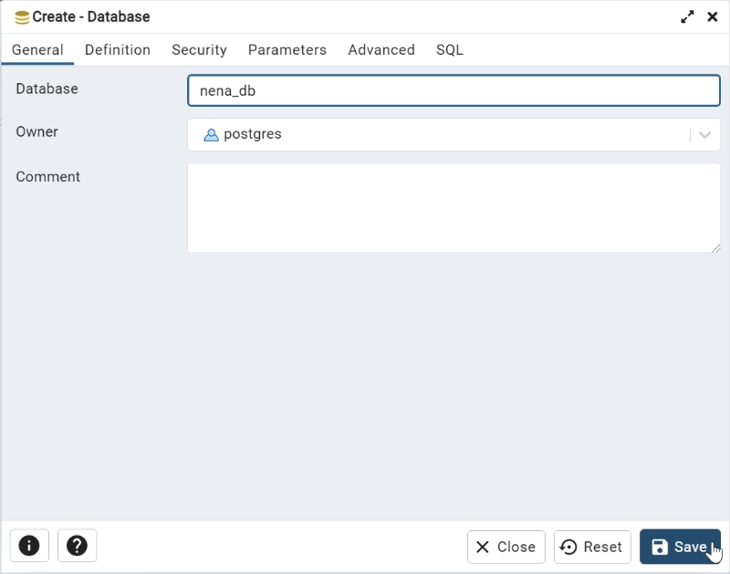

# PostgreSQL/PostGIS GIS Data Model Template

This documentation provides the step-by-step instructions to create, deploy, 
backup, and restore the NG9-1-1 Data Model Template for PostgreSQL/PostiGIS, 
prepared by the NENA Data Model Working Group. This Data Model is designed for 
an open source PostgreSQL/PostGIS database but can be adapted for other platforms.

*[2022-11-16] NOTE: This documentation is still under development.*

---

## Table of Contents

* [Getting Started](#getting-started)
  * [Dependencies](#dependencies)
  * [Creating the database](#creating-the-database)
  * [Installing PostGIS extensions](#creating-a-schema)
  * [Changing permissions](#changing-permissions-optional)
  * [Tuning PostgreSQL](#tuning-postgresql-optional)
* [Deploying the Data Model Template](#deploying-the-data-model-template)
  * [Data Model Template SQL Script](#deploying-the-data-model-template)
  * [Deploying the Data Model Initial Data](#deploying-the-data-model-initial-data)
  * [Populating the Data Model](#populating-the-data-model)
* [Backing up the Database](#backing-up-the-database)
* [Restoring the Database](#restoring-the-database)
* [Change Log](#change-log)
* [Contributors](#contributors)

---

## Getting Started

The following section covers the creation of the database and database 
management best practices. With the exception of the database creation, 
other topics of this section are recommended, but optional.

This section does not cover the specific installation of any software or 
the database management tool is the choice of the user. 

### Dependencies

In addition to the dependencies below, it is assumed that the user has a 
fundamental understanding of relational database installation and management.

* **[PostgreSQL](https://www.postgresql.org/download/)** v12 or later
  * Earlier versions should be compatible but are not recommended.
* **[PostGIS](https://postgis.net/install/)**, installable from Stack Builder 
  which is part of most compiled PostgreSQL binaries.
  * *PostGIS versions depend on the version of PostgreSQL installed.*
* **Data Management Tool of choice**
  * **[PGAdmin](https://www.pgadmin.org/)** - Web-based PostgreSQL management tool, 
    typically an option while installing from compiled PostgreSQL binaries;
  * **PSql** - Command line PostgreSQL management tool, typically an option 
    install while installing from compiled PostgreSQL binaries;
  * **[dBeaver](https://dbeaver.io/)** - Universal database management tool; or,
  * Database Management Tool of user's choice.

### Creating the database

The first step is to create a database for the NENA GIS Data Model. The process 
of creating a PostgreSQL database varies depending on the database management 
tools you prefer. Expand the instructions for your tool of choice for 
instructions:

psql Instructions

* Open **psql** from the command line. On Windows, you may need to change your 
  directory to the location of **psql** (e.g., 
  `C:\Program Files\PostgreSQL\<version number>\bin`).
* When **psql** opens the user is prompted for the server, the database, the 
  database port and the username and password. You can hit enter through each 
  of these except for the `postgres` password which you must provide before 
  hitting **Enter**.

  

* At the prompt, type `CREATE DATABASE nena_db;` and press **Enter**.  The 
  result should resemble the image below.

  

* At the prompt, type `\connect nena_db;` and press **Enter**.  This connects 
  you to the newly create database.  The result should resemble the image below.

  

pgAdmin Instructions

* Open **pgAdmin** and connect to the PostgreSQL server. *NOTE: This documentation 
  assumes that **pgAdmin** is installed on the same server with PostgreSQL. If 
  **pgAdmin** is on another computer, you will need to open ports and create a 
  connection in **pgAdmin**, which is beyond the scope of this documentation.*
* Expand the server tree and server, right-click on **Databases** > **Create** >
  **Database...** to open the **Create Database** dialog.

  

* Fill in the **Create Database** dialog to create the database. The database is 
  named `nena_db` but may be named differently. Click **Save** to create the 
  database.

  

* When completed the **pgAdmin** server tree will refresh with the newly created 
  database, as illustrated below.

  

dBeaver Instructions

* Open **dBeaver** and connect to the PostgreSQL server by right-clicking 
  in the **Database Navigator** and selecting **Create** > **Connection**.

  

* In the **Connect to a database** > **Select your database** dialog, click on 
  **PostgreSQL**, then click **Next >**.

  

* In the **Connect to a database** > **Connection Settings** dialog, on the 
  **Main** tab, enter your credentials. Use the **Test Connection** to verify 
  the connection settings are valid. On the **PostgreSQL** tab, enable the 
  **Show all databases** setting. Click **Finish**.

  

* In the **Database Navigator**, expand your PostgreSQL connection, right-click 
  on **Databases** and select **Create New Database** to open the 
  **Create database** dialog.

  

* Fill in the **Create database** dialog to create the database. The database is 
  named `nena_db` but may be named differently. Click **OK** to create the 
  database.

  

* When completed the **Database Navigator** will refresh with the newly created 
  database, as illustrated below.

  

### Installing PostGIS extensions

The next step is to add the minimum extensions (e.g., `postgis`) required to 
handle spatial data in PostgreSQL. Optionally, you may install the 
`postgis_topology` extension using `CREATE EXTENSION postgis_topology;` but it 
is not required and the process is identical. Expand the section based on your database management tool of 
choice:

psql Instructions

* At the prompt, type `CREATE EXTENSION postgis;` and press **Enter**.  The 
  result should resemble the image below.

  

* If you want to check that the postgis extension was successfully deployed, 
  type `SELECT POSTGIS_FULL_VERSION();` at the prompt and press **Enter**.

  
  
* The result should resemble the image below.  Version numbers will vary 
  depending on your environment.

  

pgAdmin Instructions

* Right-click on the **nena_db** and select **Create** > **Extension...**.

  

* In the **Create - Extension** dialog, click the **Name** dropdown and select 
  `postgis` and then click **Save**.

  

* After saving, **pgAdmin** should expand and select the newly added extension. 
  Alternatively, you can check that the postgis extension was successfully 
  deployed, by typing `SELECT POSTGIS_FULL_VERSION();` in SQL script.

  

dBeaver Instructions

* Open a **SQL Script** by right-clicking on the **nena_db** database and 
  selecting **SQL Editor** > **New SQL script**.

  

* In the **SQL script**, type `CREATE EXTENSION postgis;` and click 
  **Execute Script (<kbd>ALT</kbd> X)**.

  

* To verify the postgis extension was successfully deployed, 
  type `SELECT POSTGIS_FULL_VERSION();` at the prompt and click 
  **Execute Script (<kbd>ALT</kbd> X)**.

  

### Creating a schema

Creating a schema is an optional step, however, the SQL scripts are designed for 
a `nena` schema. If you plan to use the `public` schema, the SQL scripts 
that create the tables and initial data will need to be modified. Please 
see each document's **Modifications** section for further details. Expand 
the section based on your database management tool of choice:

psql Instructions

* At the prompt, type `CREATE SCHEMA nena;` and press **Enter**.  The result 
  should resemble the image below.

  

pgAdmin Instructions

* Right-click on the **nena_db** and select **Create** > **Schema...**.

  

* In the **Create - Schema** dialog, type `nena` the **Name** field and 
  then click **Save**.

  

* After saving, **pgAdmin** should expand and select the newly added schema.

  

dBeaver Instructions

* In the **Database Navigator**, expand the **nena_db**. Right-click on 
  **Schemas** and select **Create New Schema**.

  

* In the **Create - Schema** dialog, type `nena` the **Schema name** field and 
  then click **OK**.

  

* After saving, the **Schemas** should expand and highlight the newly added schema.

  

### Changing permissions [Optional]

It is considered best practice to not use the `postgres` database account for 
anything other that initial database creation as it is a "superuser" account. 
It is recommended once the `nena_db` is created, to create specific database 
users and roles to the `nena_db`. This process varies greatly between 
organizations and is outside the scope of this documentation.

### Tuning PostgreSQL [Optional]

PostgreSQL installs using a base configuration for buffer size, memory usage, 
and a variety of other settings. It is recommended to get the best performance 
out of your database to tune PostgreSQL to your specific server.

There are a variety of methods to determine the best settings but simple 
starting point is to use [PGTune](https://pgtune.leopard.in.ua/). PGTune 
provides the settings that can be manually applied to the `postgresql.conf` 
file or `ALTER` commands that can be executed as a SQL script.

---

## Deploying the Data Model Template

### [Data Model Template SQL Script](postgresql_data_model_schema_template.md)

The [NG9-1-1 Data Model PostGIS Template Script](postgresql_data_model_schema_template.md) 
SQL script is used to create the NG9-1-1 GIS Data Model template in PostgreSQL. 
This script is designed for PostgreSQL/PostGIS but may be adapted for other 
platforms. It is intended to run this script first.

### [Deploying the Data Model Initial Data](postgresql_data_model_initial_data_template)

The [NG9-1-1 Data Model PostGIS Initial Data Script](postgresql_data_model_initial_data_template.md) 
SQL script inserts initial data into the NG9-1-1 GIS Data Model. 
This initial data is not required and may be altered by each organization to 
meet each organization's unique operating environment and values.

### Populating the Data Model

The process to populate these template tables will specific to each organization, 
and beyond the scope of this guidance. It will likely require the development of 
custom internal ETL scripts.

---

## Backing up the Database

Coming soon...

---

## Restoring the Database

Coming soon...

---

## Change Log

* v2.0
    * Updated for [NENA-STA-006.2-2022](https://github.com/NENA911/NG911GISDataModel/blob/main/docs/nena-sta-006.2-2022_ng9-1-1.pdf)
    * Various bug fixes and optimizations
    * See [commit change]() or See [release history]()
* v1.0
    * Based on [NENA-STA-006.1.1-2020](https://github.com/NENA911/NG911GISDataModel/blob/main/docs/nena-sta-006.1.1-2020_ng9-1-1.pdf)
    * Initial Release

## Contributors

* v2.0
  * [Tom Neer](https://github.com/tomneer), Digital Data Services, Inc.
  * [Jason Horning](https://github.com/jasonhorning), North Dakota Association of Counties
* v1.0
