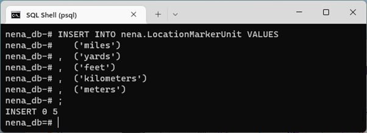
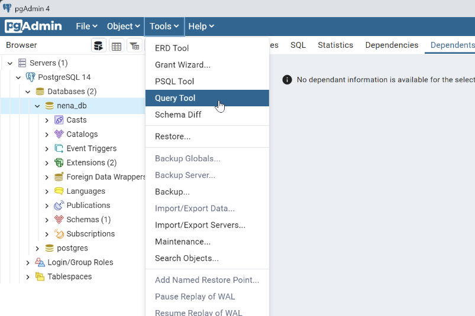
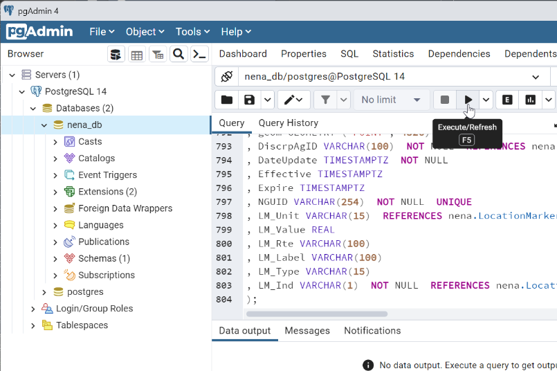
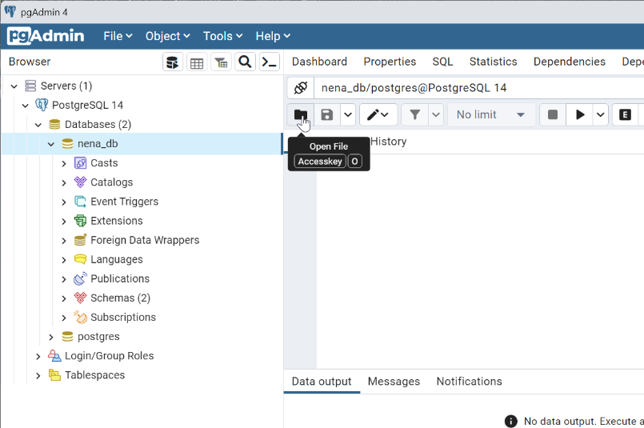
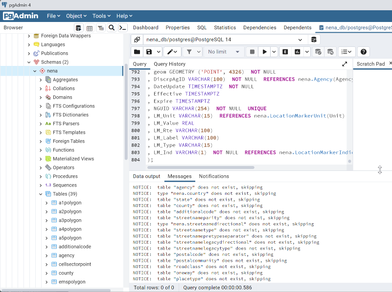
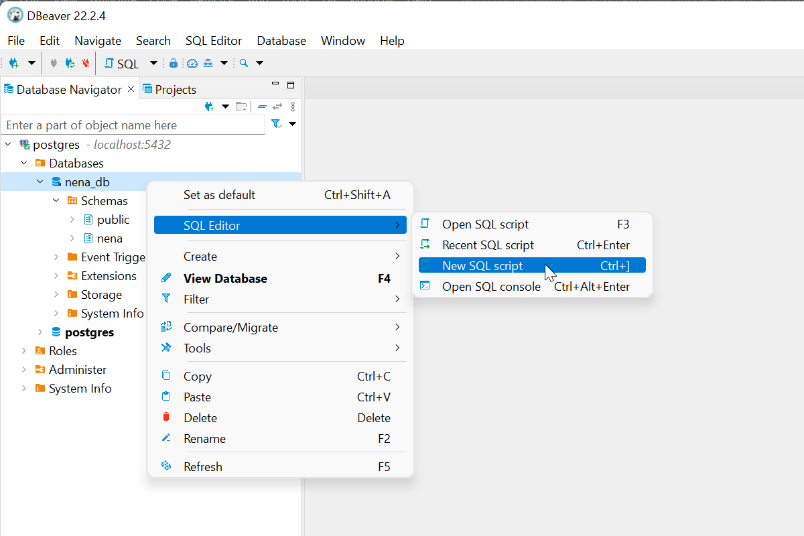
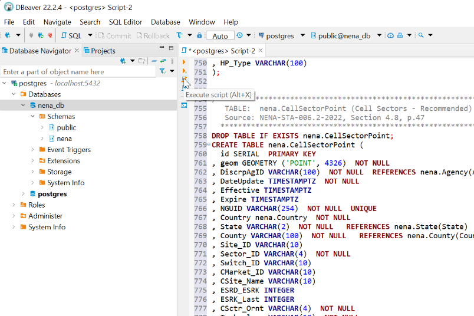
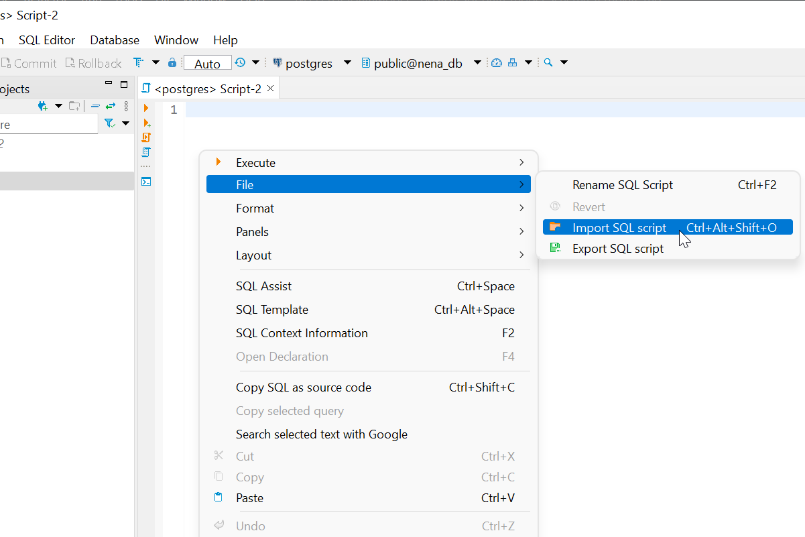
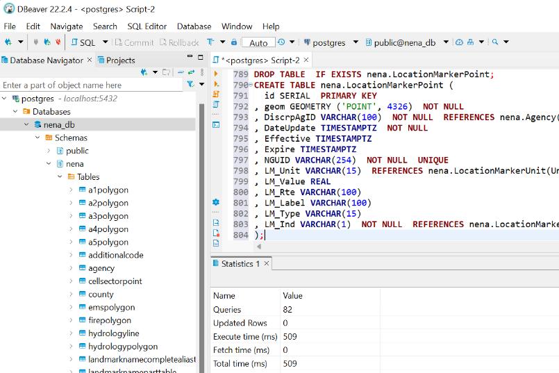

# NG9-1-1 Data Model PostGIS Initial Data Script

The following SQL script inserts initial data into the NG9-1-1 GIS Data Model. 
This initial data is not required and may be altered by each organization to 
meet each organization's unique operating environment and values.

---

## Table of Contents

* [Instructions](#instructions)
* [Pre-Deployment Modifications](#pre-deployment-modifications)
* [Data Model Initial Data SQL Script](#data-model-initial-data-sql-script)

---

## Instructions

Copy the SQL script by hovering over the SQL script and click the copy icon in 
upper right of the code block [below](#data-model-template-sql-script). The SQL 
may be used directly or modified by pasting the SQL script into a Database 
Management Tool or into a text editor and save the file as `nena-initial_data.sql`.

Execute this script after executing the 
[Initial Data Template](postgresql_data_model_initial_data_template.md).

<details>
<summary>Psql Instructions</summary>

* At the prompt, **copy** and **paste** the SQL code from the 
  [Data Model Initial Data SQL Script](#data-model-initial-data-sql-script) 
  into the **psql** shell and press **Enter**. The result should resemble the image below.

  

</details>

<details>
<summary>pgAdmin Instructions</summary>

* Select the **nena_db**, click the **Tools** menu and select **Query Tool**.

  

* **Copy** and **paste** the SQL script from the 
  [Data Model Initial Data SQL Script](#data-model-initial-data-sql-script) 
  into the **Query Tool** and click the **Execute (▶)** button.

  

  [Optionally] If you have saved the SQL script to a `.sql` file, you may 
  load the SQL script using **Open (📁)** button to load a `.sql` file from disk.

  

* After executing the SQL scripts, the Data Model tables will be under the 
  `nena` schema.

  

</details>

<details>
<summary>dBeaver Instructions</summary>

* Right-click on the **nena_db** database and select **SQL Editor** > 
  **New SQL script**.

  

* **Copy** and **paste** the SQL script from the 
  [Data Model Initial Data SQL Script](#data-model-initial-data-sql-script) into the 
  **SQL Script** window and click the **Execute script (<kbd>Alt</kbd> + X)** button.

  

  [Optionally] If you have saved the SQL script to a `.sql` file, you may 
  load the SQL script right-clicking in the SQL script and selecting **File** > 
  **Import SQL script**.

  

* After executing the SQL scripts, the Data Model tables will be under the 
  `nena` schema.

  

</details>

---

## Pre-Deployment Modifications

The script may be modified to include values specific to your organization. In 
the saved SQL script, add or remove values as appropriate for your organization.

The script may be modified to include values specific to your organization. In 
the saved SQL script, add or remove values as appropriate for your organization.

### Schema Name

This SQL script uses a SCHEMA of "nena". If you choose to use a different schema, 
use a database management tool or text editor to perform a **Find and Replace** 
of `nena.` to `<your schema>.`.

### DELETE FROM Command
The SQL script includes a command to delete all values from the tables. This 
command is commented out but can be implemented by modifying the SQL 
script into a text editor or database management tool and performing a **Find and 
Replace** of `--DELETE FROM` to `DELETE FROM`.

---

## Data Model Initial Data SQL Script

```sql
/* *****************************************************************************
   nena.State Initial Data
   Source: https://www.census.gov/library/reference/code-lists/ansi/ansi-codes-for-states.html
           per NENA-STA-006.2-2022, Section 5.107, p.77
   Last Update:  2022-11-05
   ************************************************************************** */
--DELETE FROM nena.State;
INSERT INTO nena.State values 
   ('AL','Alabama')
,  ('AK','Alaska')
,  ('AS','American Samoa')
,  ('AZ','Arizona')
,  ('AR','Arkansas')
,  ('CA','California')
,  ('CO','Colorado')
,  ('CT','Connecticut')
,  ('DE','Delaware')
,  ('DC','District of Columbia')
,  ('FM','Federated States of Micronesia')
,  ('FL','Florida')
,  ('GA','Georgia')
,  ('GU','Guam')
,  ('HI','Hawaii')
,  ('ID','Idaho')
,  ('IL','Illinois')
,  ('IN','Indiana')
,  ('IA','Iowa')
,  ('KS','Kansas')
,  ('KY','Kentucky')
,  ('LA','Louisiana')
,  ('ME','Maine')
,  ('MH','Marshall Islands')
,  ('MD','Maryland')
,  ('MA','Massachusetts')
,  ('MI','Michigan')
,  ('MN','Minnesota')
,  ('MS','Mississippi')
,  ('MO','Missouri')
,  ('MT','Montana')
,  ('NE','Nebraska')
,  ('NV','Nevada')
,  ('NH','New Hampshire')
,  ('NJ','New Jersey')
,  ('NM','New Mexico')
,  ('NY','New York')
,  ('NC','North Carolina')
,  ('ND','North Dakota')
,  ('MP','Northern Mariana Islands')
,  ('OH','Ohio')
,  ('OK','Oklahoma')
,  ('OR','Oregon')
,  ('PW','Palau')
,  ('PA','Pennsylvania')
,  ('PR','Puerto Rico')
,  ('RI','Rhode Island')
,  ('SC','South Carolina')
,  ('SD','South Dakota')
,  ('TN','Tennessee')
,  ('TX','Texas')
,  ('UT','Utah')
,  ('VT','Vermont')
,  ('UM','United States Minor Outlying Islands')
,  ('VI','Virgin Islands')
,  ('VA','Virginia')
,  ('WA','Washington')
,  ('WV','West Virginia')
,  ('WI','Wisconsin')
,  ('WY','Wyoming')
; 


/* *****************************************************************************
   nena.StreetNameParity Initial Data
   Source: Domain of NENA-STA-006.2-2022, Section 5.76/77, p.68
   ************************************************************************** */
--DELETE FROM nena.StreetNameParity;
INSERT INTO nena.StreetNameParity VALUES 
   ('O','Odd')
,  ('E', 'Even')
,  ('B','Both')
,  ('Z','Address Range 0-0')
; 


/* *****************************************************************************
   nena.StreetNameType Initial Data
   Source: http://technet.nena.org/nrs/registry/StreetNamePreTypesAndStreetNamePostTypes.xml
           per NENA-STA-006.2-2022, Section 5.116, p.80
   Last Update:  2022-11-05
   ************************************************************************** */
--DELETE FROM nena.StreetNameType;
INSERT INTO nena.StreetNameType VALUES 
   ('Abbey')
,  ('Access Road')
,  ('Acres')
,  ('Airport')
,  ('Alcove')
,  ('Alle')
,  ('Alley')
,  ('Annex')
,  ('Approach')
,  ('Arc')
,  ('Arcade')
,  ('Arch')
,  ('Avenida')
,  ('Avenue')
,  ('Avenue Circle')
,  ('Avenue Court')
,  ('Avenue Loop')
,  ('Avenue Path')
,  ('Avenue Place')
,  ('Avenue Way')
,  ('Bank')
,  ('Bay')
,  ('Bayou')
,  ('Bayway')
,  ('Beach')
,  ('Bend')
,  ('Bluff')
,  ('Bluffs')
,  ('Bottom')
,  ('Boardwalk')
,  ('Boulevard')
,  ('Branch')
,  ('Bridge')
,  ('Brook')
,  ('Brooks')
,  ('Bureau of Indian Affairs Route')
,  ('Burg')
,  ('Burgs')
,  ('Bypass')
,  ('Calle')
,  ('Camino')
,  ('Camp')
,  ('Canyon')
,  ('Cape')
,  ('Causeway')
,  ('Center')
,  ('Centre')
,  ('Centers')
,  ('Channel')
,  ('Chase')
,  ('Chemin')
,  ('Circle')
,  ('Circles')
,  ('Circus')
,  ('Cliff')
,  ('Cliffs')
,  ('Close')
,  ('Club')
,  ('Cluster')
,  ('Coast Highway')
,  ('Common')
,  ('Commons')
,  ('Concourse')
,  ('Connect')
,  ('Connector')
,  ('Corner')
,  ('Corners')
,  ('Corridor')
,  ('Corso')
,  ('Corte')
,  ('County Forest Road')
,  ('County Highway')
,  ('County Road')
,  ('County Route')
,  ('County State Aid Highway')
,  ('Cours')
,  ('Course')
,  ('Court')
,  ('Courts')
,  ('Cove')
,  ('Coves')
,  ('Creek')
,  ('Crescent')
,  ('Crest')
,  ('Cross')
,  ('Crossing')
,  ('Crossings')
,  ('Crossover')
,  ('Crossroad')
,  ('Crossroads')
,  ('Crossway')
,  ('Curve')
,  ('Custer County Road')
,  ('Cutoff')
,  ('Cutting')
,  ('Dale')
,  ('Dam')
,  ('Dawson County Road')
,  ('Dell')
,  ('Divide')
,  ('Dock')
,  ('Down')
,  ('Downs')
,  ('Draw')
,  ('Drift')
,  ('Drive')
,  ('Drives')
,  ('Driveway')
,  ('Echo')
,  ('Edge')
,  ('End')
,  ('Entrance')
,  ('Entry')
,  ('Esplanade')
,  ('Estate')
,  ('Estates')
,  ('Exchange')
,  ('Exit')
,  ('Expressway')
,  ('Extension')
,  ('Extensions')
,  ('Fall')
,  ('Falls')
,  ('Fare')
,  ('Farm')
,  ('Federal-Aid Secondary Highway')
,  ('Ferry')
,  ('Field')
,  ('Fields')
,  ('Flat')
,  ('Flats')
,  ('Flowage')
,  ('Flyway')
,  ('Ford')
,  ('Fords')
,  ('Forest')
,  ('Forest Road')
,  ('Forest Highway')
,  ('Forge')
,  ('Forges')
,  ('Fork')
,  ('Forks')
,  ('Fort')
,  ('Freeway')
,  ('Front')
,  ('Frontage Road')
,  ('Gables')
,  ('Garden')
,  ('Gardens')
,  ('Garth')
,  ('Gate')
,  ('Gates')
,  ('Gateway')
,  ('Glade')
,  ('Glen')
,  ('Glens')
,  ('Gorge')
,  ('Grade')
,  ('Green')
,  ('Greens')
,  ('Greenway')
,  ('Grove')
,  ('Groves')
,  ('Harbor')
,  ('Harbors')
,  ('Harbour')
,  ('Haul Road')
,  ('Haven')
,  ('Heath')
,  ('Heights')
,  ('Highway')
,  ('Hill')
,  ('Hills')
,  ('Hollow')
,  ('Horseshoe')
,  ('Indian Service Road')
,  ('Inlet')
,  ('Interstate')
,  ('Interval')
,  ('Island')
,  ('Islands')
,  ('Isle')
,  ('Isles')
,  ('J-Turn')
,  ('Junction')
,  ('Junctions')
,  ('Keep')
,  ('Key')
,  ('Keys')
,  ('Knoll')
,  ('Knolls')
,  ('Lair')
,  ('Lake')
,  ('Lakes')
,  ('Land')
,  ('Landing')
,  ('Lane')
,  ('Lane Circle')
,  ('Lane Court')
,  ('Lane Road')
,  ('Lateral')
,  ('Ledge')
,  ('Light')
,  ('Lights')
,  ('Line')
,  ('Loaf')
,  ('Lock')
,  ('Locks')
,  ('Lodge')
,  ('Lookout')
,  ('Loop')
,  ('Loop Road')
,  ('Mall')
,  ('Manor')
,  ('Manors')
,  ('Market')
,  ('Meadow')
,  ('Meadows')
,  ('Mews')
,  ('Mill')
,  ('Mills')
,  ('Mission')
,  ('Montana Highway')
,  ('Motorway')
,  ('Mount')
,  ('Mountain')
,  ('Mountains')
,  ('Narrows')
,  ('National Forest Development Road')
,  ('Neck')
,  ('Nook')
,  ('North Carolina Highway')
,  ('Old County Road')
,  ('Orchard')
,  ('Oval')
,  ('Overlook')
,  ('Overpass')
,  ('Park')
,  ('Parke')
,  ('Parks')
,  ('Parkway')
,  ('Parkways')
,  ('Paseo')
,  ('Pass')
,  ('Passage')
,  ('Path')
,  ('Pathway')
,  ('Pike')
,  ('Pine')
,  ('Pines')
,  ('Place')
,  ('Plain')
,  ('Plains')
,  ('Platz')
,  ('Plaza')
,  ('Point')
,  ('Pointe')
,  ('Points')
,  ('Port')
,  ('Ports')
,  ('Prairie')
,  ('Private Road')
,  ('Promenade')
,  ('Quarter')
,  ('Quay')
,  ('Ramp')
,  ('Radial')
,  ('Ranch')
,  ('Rapid')
,  ('Rapids')
,  ('Reach')
,  ('Recreational Road')
,  ('Rest')
,  ('Retreat')
,  ('Ridge')
,  ('Ridges')
,  ('Rise')
,  ('River')
,  ('River Road')
,  ('Road')
,  ('Roads')
,  ('Round')
,  ('Route')
,  ('Row')
,  ('Rue')
,  ('Run')
,  ('Runne')
,  ('Runway')
,  ('Shoal')
,  ('Shoals')
,  ('Shore')
,  ('Shores')
,  ('Skies')
,  ('Skyway')
,  ('Slip')
,  ('Spring')
,  ('Springs')
,  ('Spur')
,  ('Spurs')
,  ('Square')
,  ('Squares')
,  ('State Highway')
,  ('State Park Road')
,  ('State Parkway')
,  ('State Road')
,  ('State Route')
,  ('State Secondary')
,  ('State Spur')
,  ('Station')
,  ('Strand')
,  ('Strasse')
,  ('Stravenue')
,  ('Stream')
,  ('Street')
,  ('Street Circle')
,  ('Street Court')
,  ('Street Loop')
,  ('Street Path')
,  ('Street Place')
,  ('Street Way')
,  ('Streets')
,  ('Strip')
,  ('Summit')
,  ('Taxiway')
,  ('Terminal')
,  ('Tern')
,  ('Terrace')
,  ('Throughway')
,  ('Thruway')
,  ('Timber Road')
,  ('Township Road')
,  ('Trace')
,  ('Track')
,  ('Trafficway')
,  ('Trail')
,  ('Trailer')
,  ('Triangle')
,  ('Truck Trail')
,  ('Tunnel')
,  ('Turn')
,  ('Turnpike')
,  ('United States Forest Service Road')
,  ('United States Highway')
,  ('Underpass')
,  ('Union')
,  ('Unions')
,  ('Valley')
,  ('Valleys')
,  ('Via')
,  ('Viaduct')
,  ('View')
,  ('Views')
,  ('Villa')
,  ('Village')
,  ('Villages')
,  ('Ville')
,  ('Vista')
,  ('Waddy')
,  ('Walk')
,  ('Walks')
,  ('Wall')
,  ('Way')
,  ('Ways')
,  ('Weeg')
,  ('Well')
,  ('Wells')
,  ('Woods')
,  ('Wye')
,  ('Wynd')
;


/* *****************************************************************************
   nena.StreetNamePreTypeSeparator Initial Data
   Source: http://technet.nena.org/nrs/registry/StreetNamePreTypeSeparators.xml
           per NENA-STA-006.2-2022, Section 5.117, p.80
   Last Update:  2022-11-05
   ************************************************************************** */
--DELETE FROM nena.StreetNamePreTypeSeparator;
INSERT INTO nena.StreetNamePreTypeSeparator VALUES 
   ('of the')
,  ('at')
,  ('de')
,  ('de la')
,  ('de las')
,  ('del')
,  ('des')
,  ('in the')
,  ('to the')
,  ('of')
,  ('on the')
,  ('to')
;


/* *****************************************************************************
   nena.StreetNameLegacyDirectional Initial Data
   Source: Domain of NENA-STA-006.2-2022, Section 5.57, p.64
   ************************************************************************** */
--DELETE FROM nena.StreetNameLegacyDirectional;
INSERT INTO nena.StreetNameLegacyDirectional VALUES
   ('N','North')
,  ('S','South')
,  ('E','East')
,  ('W','West')
,  ('NE','Northeast')
,  ('NW','Northwest')
,  ('SE','Southeast')
,  ('SW','Southwest')
,  ('O','Ouest')
,  ('NO','Nord-Ouest')
,  ('SO','Sud-Ouest')
;


/* *****************************************************************************
   nena.StreetNameLegacyType Initial Data
   Source: NENA-STA-006.2-2022, Section 5.78, p.69
           https://pe.usps.com/text/pub28/28apc_002.htm is used as a baseline. 
           Additional values may be added to meet local vernacular.
   Last Update:  2022-11-05
   ************************************************************************** */
--DELETE FROM nena.StreetNameLegacyType;
INSERT INTO nena.StreetNameLegacyType VALUES 
   ('ALY','ALLEY')
,  ('ANX','ANEX')
,  ('ARC','ARCADE')
,  ('AVE','AVENUE')
,  ('BYU','BAYOU')
,  ('BCH','BEACH')
,  ('BND','BEND')
,  ('BLF','BLUFF')
,  ('BLFS','BLUFFS')
,  ('BTM','BOTTOM')
,  ('BLVD','BOULEVARD')
,  ('BR','BRANCH')
,  ('BRG','BRIDGE')
,  ('BRK','BROOK')
,  ('BRKS','BROOKS')
,  ('BG','BURG')
,  ('BGS','BURGS')
,  ('BYP','BYPASS')
,  ('CP','CAMP')
,  ('CYN','CANYON')
,  ('CPE','CAPE')
,  ('CSWY','CAUSEWAY')
,  ('CTR','CENTER')
,  ('CTRS','CENTERS')
,  ('CIR','CIRCLE')
,  ('CIRS','CIRCLES')
,  ('CLF','CLIFF')
,  ('CLFS','CLIFFS')
,  ('CLB','CLUB')
,  ('CMN','COMMON')
,  ('CMNS','COMMONS')
,  ('COR','CORNER')
,  ('CORS','CORNERS')
,  ('CRSE','COURSE')
,  ('CT','COURT')
,  ('CTS','COURTS')
,  ('CV','COVE')
,  ('CVS','COVES')
,  ('CRK','CREEK')
,  ('CRES','CRESCENT')
,  ('CRST','CREST')
,  ('XING','CROSSING')
,  ('XRD','CROSSROAD')
,  ('XRDS','CROSSROADS')
,  ('CURV','CURVE')
,  ('DL','DALE')
,  ('DM','DAM')
,  ('DV','DIVIDE')
,  ('DR','DRIVE')
,  ('DRS','DRIVES')
,  ('EST','ESTATE')
,  ('ESTS','ESTATES')
,  ('EXPY','EXPRESSWAY')
,  ('EXT','EXTENSION')
,  ('EXTS','EXTENSIONS')
,  ('FALL','FALL')
,  ('FLS','FALLS')
,  ('FRY','FERRY')
,  ('FLD','FIELD')
,  ('FLDS','FIELDS')
,  ('FLT','FLAT')
,  ('FLTS','FLATS')
,  ('FRD','FORD')
,  ('FRDS','FORDS')
,  ('FRST','FOREST')
,  ('FRG','FORGE')
,  ('FRGS','FORGES')
,  ('FRK','FORK')
,  ('FRKS','FORKS')
,  ('FT','FORT')
,  ('FWY','FREEWAY')
,  ('GDN','GARDEN')
,  ('GDNS','GARDENS')
,  ('GTWY','GATEWAY')
,  ('GLN','GLEN')
,  ('GLNS','GLENS')
,  ('GRN','GREEN')
,  ('GRNS','GREENS')
,  ('GRV','GROVE')
,  ('GRVS','GROVES')
,  ('HBR','HARBOR')
,  ('HBRS','HARBORS')
,  ('HVN','HAVEN')
,  ('HTS','HEIGHTS')
,  ('HWY','HIGHWAY')
,  ('HL','HILL')
,  ('HLS','HILLS')
,  ('HOLW','HOLLOW')
,  ('INLT','INLET')
,  ('IS','ISLAND')
,  ('ISS','ISLANDS')
,  ('ISLE','ISLE')
,  ('JCT','JUNCTION')
,  ('JCTS','JUNCTIONS')
,  ('KY','KEY')
,  ('KYS','KEYS')
,  ('KNL','KNOLL')
,  ('KNLS','KNOLLS')
,  ('LK','LAKE')
,  ('LKS','LAKES')
,  ('LAND','LAND')
,  ('LNDG','LANDING')
,  ('LN','LANE')
,  ('LGT','LIGHT')
,  ('LGTS','LIGHTS')
,  ('LF','LOAF')
,  ('LCK','LOCK')
,  ('LCKS','LOCKS')
,  ('LDG','LODGE')
,  ('LOOP','LOOP')
,  ('MALL','MALL')
,  ('MNR','MANOR')
,  ('MNRS','MANORS')
,  ('MDW','MEADOW')
,  ('MDWS','MEADOWS')
,  ('MEWS','MEWS')
,  ('ML','MILL')
,  ('MLS','MILLS')
,  ('MSN','MISSION')
,  ('MTWY','MOTORWAY')
,  ('MT','MOUNT')
,  ('MTN','MOUNTAIN')
,  ('MTNS','MOUNTAINS')
,  ('NCK','NECK')
,  ('ORCH','ORCHARD')
,  ('OVAL','OVAL')
,  ('OPAS','OVERPASS')
,  ('PARK','PARK(S)')
,  ('PKWY','PARKWAY(S)')
,  ('PASS','PASS')
,  ('PSGE','PASSAGE')
,  ('PATH','PATH')
,  ('PIKE','PIKE')
,  ('PNE','PINE')
,  ('PNES','PINES')
,  ('PL','PLACE')
,  ('PLN','PLAIN')
,  ('PLNS','PLAINS')
,  ('PLZ','PLAZA')
,  ('PT','POINT')
,  ('PTS','POINTS')
,  ('PRT','PORT')
,  ('PRTS','PORTS')
,  ('PR','PRAIRIE')
,  ('RADL','RADIAL')
,  ('RAMP','RAMP')
,  ('RNCH','RANCH')
,  ('RPD','RAPID')
,  ('RPDS','RAPIDS')
,  ('RST','REST')
,  ('RDG','RIDGE')
,  ('RDGS','RIDGES')
,  ('RIV','RIVER')
,  ('RD','ROAD')
,  ('RDS','ROADS')
,  ('RTE','ROUTE')
,  ('ROW','ROW')
,  ('RUE','RUE')
,  ('RUN','RUN')
,  ('SHL','SHOAL')
,  ('SHLS','SHOALS')
,  ('SHR','SHORE')
,  ('SHRS','SHORES')
,  ('SKWY','SKYWAY')
,  ('SPG','SPRING')
,  ('SPGS','SPRINGS')
,  ('SPUR','SPUR(S)')
,  ('SQ','SQUARE')
,  ('SQS','SQUARES')
,  ('STA','STATION')
,  ('STRA','STRAVENUE')
,  ('STRM','STREAM')
,  ('ST','STREET')
,  ('STS','STREETS')
,  ('SMT','SUMMIT')
,  ('TER','TERRACE')
,  ('TRWY','THROUGHWAY')
,  ('TRCE','TRACE')
,  ('TRAK','TRACK')
,  ('TRFY','TRAFFICWAY')
,  ('TRL','TRAIL')
,  ('TRLR','TRAILER')
,  ('TUNL','TUNNEL')
,  ('TPKE','TURNPIKE')
,  ('UPAS','UNDERPASS')
,  ('UN','UNION')
,  ('UNS','UNIONS')
,  ('VLY','VALLEY')
,  ('VLYS','VALLEYS')
,  ('VIA','VIADUCT')
,  ('VW','VIEW')
,  ('VWS','VIEWS')
,  ('VLG','VILLAGE')
,  ('VLGS','VILLAGES')
,  ('VL','VILLE')
,  ('VIS','VISTA')
,  ('WALK','WALK(S)')
,  ('WALL','WALL')
,  ('WAY','WAY')
,  ('WAYS','WAYS')
,  ('WL','WELL')
,  ('WLS','WELLS')
;


/* *****************************************************************************
   nena.RoadClass Initial Data
   Source: Domain of NENA-STA-006.2-2022, Section 5.96, p.73
   ISSUE:  Domain specifies the use of 'Walkway/Pedestrian Trail' and 
           'Bike Path or Trail' both of which exceed the 15 character length 
           of the RoadClass field in RoadCenterLines. Change the classes to
           'Walkway' and 'Trail' respectively temporarily.
   ************************************************************************** */
--DELETE FROM nena.RoadClass;
INSERT INTO nena.RoadClass VALUES 
   ('Primary','Primary roads are limited-access highways that connect to other roads only at interchanges and not at at-grade intersections')
,  ('Secondary','Secondary roads are main arteries that are not limited access, usually in the U.S. highway, state highway, or county highway systems.')
,  ('Local','Generally a paved non-arterial street, road, or byway that usually has a single lane of traffic in each direction.')
,  ('Ramp','A road that allows controlled access from adjacent roads onto a limited access highway, often in the form of a cloverleaf interchange.')
,  ('Service Drive','A road, usually paralleling a limited access highway, that provides access to structures and/or service facilities along the highway')
,  ('Vehicular Trail','An unpaved dirt trail where a four-wheel drive vehicle is required. These vehicular trails are found almost exclusively in very rural areas.')
,  ('Walkway/Pedestrian Trail','A path that is used for walking, being either too narrow for or legally restricted from vehicular traffic.')
,  ('Stairway','A pedestrian passageway from one level to another by a series of steps.')
,  ('Alley','A service road that does not generally have associated addressed structures and is usually unnamed. It is located at the rear of buildings and properties and is used for deliveries.')
,  ('Private','A road within private property that is privately maintained for service, extractive, or other purposes. These roads are often unnamed.')
,  ('Parking Lot','The main travel route for vehicles through a paved parking area. This may include unnamed roads through apartment/condominium/office complexes where pull-in parking spaces line the road.')
,  ('Bike Path or Trail','(Ski, Bike, Walking/Hikding Trail) is generally a path used by human powered modes of transportation.')
,  ('Bridle Path','A path that is used for horses, being either too narrow for or legally restricted from vehicular traffic.')
,  ('Other','Any road or path type that does not fit into the above categories')
;


/* *****************************************************************************
   nena.OneWay Initial Data
   Source: Domain of NENA-STA-006.2-2022, Section 5.75, p.68
   ************************************************************************** */
--DELETE FROM nena.OneWay;
INSERT INTO nena.OneWay VALUES 
   ('B', 'Travel in both directions allowed')
,  ('FT','One-way traveling from FROM node to TO node')
,  ('TF','One way traveling from TO node to FROM node')
; 


/* *****************************************************************************
   nena.PlaceType Initial Data
   Source: https://www.iana.org/assignments/location-type-registry/location-type-registry.xml
           per NENA-STA-006.2-2022, Section 5.78, p.69
   Last Update:  2022-11-05
   ************************************************************************** */
--DELETE FROM nena.PlaceType;
INSERT INTO nena.PlaceType VALUES 
   ('airport','A place from which aircrafts operate, such as an airport or heliport.')
,  ('arena','Enclosed area used for sports events.')
,  ('bank','Business establishment in which money is kept for saving, commercial purposes, is invested, supplied for loans, or exchanged.')
,  ('bar','A bar or saloon.')
,  ('bus-station','Terminal that serves bus passengers, such as a bus depot or bus terminal.')
,  ('cafe','Usually a small and informal establishment that serves various refreshments (such as coffee); coffee shop.')
,  ('classroom','Academic classroom or lecture hall.')
,  ('club','Dance club, nightclub, or discotheque.')
,  ('construction','Construction site.')
,  ('convention-center','Convention center or exhibition hall.')
,  ('government','Government building, such as those used by the legislative, executive, or judicial branches of governments, including court houses, police stations, and military installations.')
,  ('hospital','Hospital, hospice, medical clinic, mental institution, or doctor''s office.')
,  ('hotel','Hotel, motel, inn, or other lodging establishment.')
,  ('industrial','Industrial setting, such as a manufacturing floor or power plant.')
,  ('library','Library or other public place in which literary and artistic materials, such as books, music, periodicals, newspapers, pamphlets, prints, records, and tapes, are kept for reading, reference, or lending.')
,  ('museum','Location where objects of historical, artistic, scientific or cultural interest are stored and exhibited.')
,  ('office','Business setting, such as an office.')
,  ('other','A place without a registered place type representation.')
,  ('outdoors','Outside a building, in or into the open air, such as a park or city streets.')
,  ('parking','A parking lot or parking garage.')
,  ('place-of-worship','A religious site where congregations gather for religious observances, such as a church, chapel, meetinghouse, mosque, shrine, synagogue, or temple.')
,  ('prison','Correctional institution where persons are confined while on trial or for punishment, such as a prison, penitentiary, jail, brig.')
,  ('public','Public area such as a shopping mall, street, park, public building, train station, or airport or in public conveyance such as a bus, train, plane, or ship. This general description encompasses the more precise descriptors ''street'', ''public-transport'', ''airport'' and so on.')
,  ('residence','A private or residential setting, not necessarily the personal residence of the entity, e.g., including a friend''s home.')
,  ('restaurant','Restaurant, coffee shop, or other public dining establishment.')
,  ('school','School or university property, but not necessarily a classroom or library.')
,  ('shopping-area','Shopping mall or shopping area. This area is a large, often enclosed, shopping complex containing various stores, businesses, and restaurants usually accessible by common passageways.')
,  ('stadium','Large, usually open structure for sports events, including a racetrack.')
,  ('store','Place where merchandise is offered for sale, such as a shop.')
,  ('street','A public thoroughfare, such as an avenue, street, alley, lane, or road, including any sidewalks.')
,  ('theater','Theater, lecture hall, auditorium, classroom, movie theater, or similar facility designed for presentations, talks, plays, music performances, and other events involving an audience.')
,  ('train-station','Terminal where trains load or unload passengers or goods; railway station, railroad station, railroad terminal, train depot.')
,  ('unknown','The type of place is unknown.')
,  ('warehouse','Place in which goods or merchandise are stored, such as a storehouse or self-storage facility.')
,  ('water','In, on, or above bodies of water, such as an ocean, lake, river, canal, or other waterway.')
;


/* *****************************************************************************
   nena.PlacementMethod Initial Data
   Source: http://technet.nena.org/nrs/registry/SiteStructureAddressPointPlacementMethod.xml 
           per NENA-STA-006.2-2022, Section 5.79, p.69
   Last Update:  2022-11-05
   ************************************************************************** */
--DELETE FROM nena.PlacementMethod;
INSERT INTO nena.PlacementMethod VALUES 
   ('Geocoding')
,  ('Parcel')
,  ('Property Access')
,  ('Site')
,  ('Structure')
,  ('Unknown')
;


/* *****************************************************************************
   nena.ServiceURN Initial Data
   Source:  TBD based on Working Group Direction
   ************************************************************************** */
--DELETE FROM nena.ServiceURN;
INSERT INTO nena.ServiceURN VALUES 
   ('urn:service:sos', 'The generic ""sos"" service reaches a public safety answering point (PSAP), which in turn dispatches aid appropriate to the emergency.')
,  ('urn:service:sos.ambulance', 'This service identifier reaches an ambulance service that provides emergency medical assistance and transportation.')
,  ('urn:service:sos.animal-control', 'Animal control typically enforces laws and ordinances pertaining to animal control and management, investigates cases of animal abuse, educates the community in responsible pet ownership and wildlife care, and provides for the housing and care of homeless animals, among other animal-related services.')
,  ('urn:service:sos.fire', 'The \"fire\" service identifier summons the fire service, also known as the fire brigade or fire department.')
,  ('urn:service:sos.gas', 'The "gas" service allows the reporting of natural gas (and other flammable gas) leaks or other natural gas emergencies.')
,  ('urn:service:sos.marine', 'The "marine" service refers to maritime search and rescue services such as those offered by the coast guard, lifeboat, or surf lifesavers.')
,  ('urn:service:sos.mountain', 'The "mountain" service refers to mountain rescue services (i.e., search and rescue activities that occur in a mountainous environment), although the term is sometimes also used to apply to search and rescue in other wilderness environments.')
,  ('urn:service:sos.physician', 'The "physician" emergency service connects the caller to a physician referral service.')
,  ('urn:service:sos.poison', 'The "poison" service refers to special information centers set up to inform citizens about how to respond to potential poisoning.')
,  ('urn:service:sos.police', 'The "police" service refers to the police department or other law enforcement authorities.')
,  ('urn:service:sos.police.municipal': 'A police force that serves an incorporated community, city or other local area.')
,  ('urn:service:sos.police.national': 'A police force that serves an entire country.')
,  ('urn:emergency:service:sos.psap', 'Route calls to primary PSAP.')
,  ('urn:emergency:service:sos.level_2_esrp', 'Route calls to a second level ESRP (for an example, a state ESRP routing towards a county ESRP).')
,  ('urn:emergency:service:sos.level_3_esrp', 'Route calls to a third level ESRP (for example, a regional ESRP that received a call from a state ESRP and in turn routes towards a county ESRP).')
,  ('urn:emergency:service:sos.call_taker', 'Route calls to a call taker within a PSAP.')
,  ('urn:emergency:service:test.psap', 'Route test calls to primary PSAP.')
,  ('urn:emergency:service:test.level_2_esrp', 'Route test calls to a second level ESRP (for an example, a state ESRP routing towards a county ESRP).')
,  ('urn:emergency:service:test.level_3_esrp', 'Route test calls to a third level ESRP (for example, a regional ESRP that received a call from a state ESRP and in turn routes towards a county ESRP).')
,  ('urn:emergency:service:test.call_taker', 'Normally not used, but some implementations may make use of this urn.')
,  ('urn:emergency:service:responder.police', 'Police Agency')
,  ('urn:emergency:service:responder.fire', 'Fire Department')
,  ('urn:emergency:service:responder.ems', 'Emergency Medical Service')
,  ('urn:emergency:service:responder.poison_control', 'Poison Control Center')
,  ('urn:emergency:service:responder.mountain_rescue', 'Mountain Rescue Service')
,  ('urn:emergency:service:responder.coast_guard', 'Coast Guard Station')
,  ('urn:emergency:service:responder.psap', 'Other purposes beyond use for dispatch via ECRF')
,  ('urn:emergency:service:responder.police.federal', 'An appropriate federal agency.')
,  ('urn:emergency:service:responder.police.stateProvincial', 'State or provincial police office')
,  ('urn:emergency:service:responder.police.tribal', 'Native American police (reservation)')
,  ('urn:emergency:service:responder.police.countyParish', 'County or Parish police (not Sheriff)')
,  ('urn:emergency:service:responder.police.sheriff', 'Sheriff''s office, when both a police and Sheriff dispatch may be possible')
,  ('urn:emergency:service:responder.police.local', 'City, Town, Township, Borough or Village police')
,  ('urn:emergency:service:responder.federal.fbi', 'Federal Bureau of Investigation')
,  ('urn:emergency:service:responder.federal.rcmp', 'Royal Canadian Mounted Police')
,  ('urn:emergency:service:responder.federal.usss', 'U.S. Secret Service')
,  ('urn:emergency:service:responder.federal.dea', 'Drug Enforcement Agency')
,  ('urn:emergency:service:responder.federal.marshal', 'Marshals Service')
,  ('urn:emergency:service:responder.federal.cbp', 'Customs and Border Protection')
,  ('urn:emergency:service:responder.federal.ice', 'Immigration and Customs Enforcement')
,  ('urn:emergency:service:responder.federal.atf', 'Bureau of Alcohol, Tobacco, Fire Arms and Explosives')
,  ('urn:emergency:service:responder.federal.pp', 'U.S. Park Police')
,  ('urn:emergency:service:responder.federal.dss', 'Diplomatic Security Service')
,  ('urn:emergency:service:responder.federal.fps', 'Federal Protective Service')
,  ('urn:emergency:service:responder.federal.military', 'Used for military installations')
,  ('urn:emergency:service:responder.fire.forest', 'Forest Fire Service')
,  ('urn:emergency:service:responder.fire.airport', 'Airport Fire Service')
,  ('urn:emergency:service:responder.fire.military', 'Used for military installations')
,  ('urn:emergency:service:responder.fire.private', 'Private Fire Service')
,  ('urn:emergency:service:responder.ems.tribal', 'Native American EMS (reservation)')
,  ('urn:emergency:service:responder.ems.countyParish', 'County or Parish EMS')
,  ('urn:emergency:service:responder.ems.local', 'City, Town, Township, Borough or Village EMS')
,  ('urn:emergency:service:responder.ems.private', 'Contracted Ambulance Service')
,  ('urn:emergency:service:responder.ems.military', 'Used for military installations')
,  ('urn:emergency:service:serviceAgencyLocator', 'Return a URI to a Service or Agency')
,  ('urn:emergency:service:serviceagencyLocator.ADR', 'Additional Data Repository (if hosted on an ESInet)')
,  ('urn:emergency:service:serviceagencyLocator.Bridge', 'Bridge')
,  ('urn:emergency:service:serviceagencyLocator.BCF', 'Border Control Function')
,  ('urn:emergency:service:serviceagencyLocator.ECRF', 'Emergency Call Routing Function')
,  ('urn:emergency:service:serviceagencyLocator.ESRP', 'Emergency Service Routing Proxy')
,  ('urn:emergency:service:serviceagencyLocator.GCS', 'Geocode Conversion Service')
,  ('urn:emergency:service:serviceagencyLocator.IMR', 'Interactive Media Response Service')
,  ('urn:emergency:service:serviceagencyLocator.Logging', 'Logging Service')
,  ('urn:emergency:service:serviceagencyLocator.LVF', 'Location Validation Function')
,  ('urn:emergency:service:serviceagencyLocator.MCS', 'MSAG Conversion Service')
,  ('urn:emergency:service:serviceagencyLocator.MDS', 'Mapping Data Service')
,  ('urn:emergency:service:serviceagencyLocator.PolicyStore', 'Policy Store')
,  ('urn:emergency:service:serviceagencyLocator.PSAP', 'PSAP')
,  ('urn:emergency:service:serviceagencyLocator.SAL', 'Service/Agency Locator')
,  ('urn:emergency:service:additionalData', 'Return a URI to an Additional Data structure as defined in NENA-STA-012.2.')
;


/* *****************************************************************************
   nena.LocationMarkerIndicator Initial Data
   Source:  Domain of NENA-STA-006.2-2022, Section 5.59, p.64
   ************************************************************************** */
--DELETE FROM nena.LocationMarkerIndicator;
INSERT INTO nena.LocationMarkerIndicator VALUES
  ('P', 'Posted')
, ('L', 'Logical/Calculated')
; 


/* *****************************************************************************
   nena.LocationMarkerUnit Initial Data
   Source:  Example of NENA-STA-006.2-2022, Section 5.64, p.65
   ************************************************************************** */
--DELETE FROM nena.LocationMarkerUnit;
INSERT INTO nena.LocationMarkerUnit VALUES 
   ('miles')
,  ('yards')
,  ('feet')
,  ('kilometers')
,  ('meters')
; 
```
