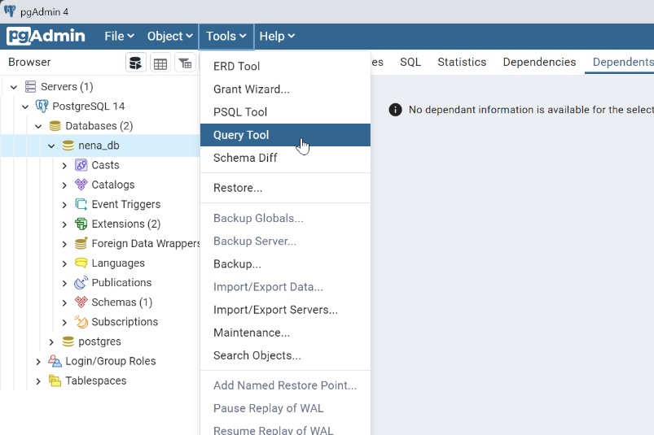
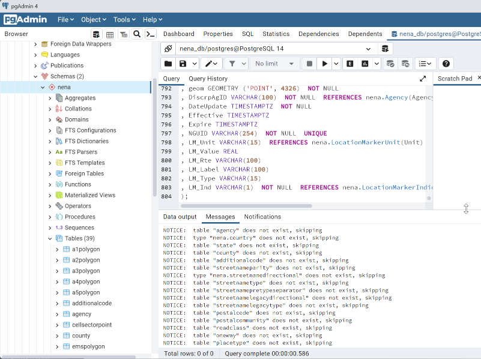
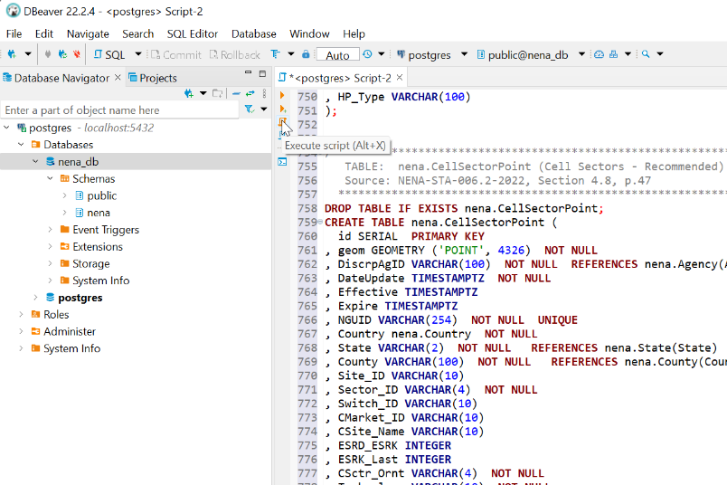

# NG9-1-1 Data Model PostGIS Template Script

The following SQL script is used to create the NG9-1-1 GIS Data Model template 
in PostgreSQL. This script is designed for PostgreSQL/PostGIS but may be 
adapted for other database platforms.

---

## Table of Contents

* [Instructions](#instructions)
* [Pre-Deployment Modifications](#pre-deployment-modifications)
* [Data Model Template SQL Script](#data-model-template-sql-script)

---

## Instructions

Copy the SQL script by hovering over the SQL script and click the copy icon in 
upper right of the code block [below](#data-model-template-sql-script). The SQL 
may be used directly or modified by pasting the SQL script into a Database 
Management Tool or into a text editor and save the file as `nena-schema.sql`.

Execute this script before executing the 
[Initial Data Template](postgresql_data_model_initial_data_template.md).

<details>
<summary>Psql Instructions</summary>

* At the prompt, **paste** the SQL code from the 
  [Data Model Template SQL Script](#data-model-template-sql-script) into the 
  **psql** shell and press **Enter**.  The result should resemble the image below.

  

</details>

<details>
<summary>pgAdmin Instructions</summary>

* Select the **nena_db**, click the **Tools** menu and select **Query Tool**.

  

* **Copy** and **paste** the SQL script from the 
  [Data Model Template SQL Script](#data-model-template-sql-script) into the 
  **Query Tool** and click the **Execute (▶)** button.

  

  [Optionally] If you have saved the SQL script to a `.sql` file, you may 
  load the SQL script using **Open (📁)** button to load a `.sql` file from disk.

  

* After executing the SQL scripts, the Data Model tables will be under the 
  `nena` schema.

  

</details>

<details>
<summary>dBeaver Instructions</summary>

* Right-click on the **nena_db** database and select **SQL Editor** > 
  **New SQL script**.

  

* **Copy** and **paste** the SQL script from the 
  [Data Model Template SQL Script](#data-model-template-sql-script) into the 
  **SQL Script** window and click the **Execute script (<kbd>Alt</kbd> + X)** button.

  

  [Optionally] If you have saved the SQL script to a `.sql` file, you may 
  load the SQL script right-clicking in the SQL script and selecting **File** > 
  **Import SQL script**.

  

* After executing the SQL scripts, the Data Model tables will be under the 
  `nena` schema.

  

</details>

---

## Pre-Deployment Modifications

The script may be modified to include values specific to your organization. In 
the saved SQL script, add or remove values as appropriate for your organization.

### Schema Name

This SQL script uses a SCHEMA of "nena". If you choose to use a different schema, 
use a database management tool or text editor to perform a **Find and Replace** 
of `nena.` to `<your schema>.`.

### "id" field

This SQL script includes an "id" field as best practice. NENA does not 
include an "id" field as part of the NENA-STA-006.2-2002 Standard. For the 
transfer of data between organizations, the NGUID field is sufficient. However, 
if your organization plans to perform updates on records a row id is required by 
PostgreSQL to prevent update conflicts. This is similar to the default 
"OBJECTID" field in Esri databases.

To remove the "id" field, use a database management tool or text editor to 
perform a **Find and Replace** of `  id SERIAL  PRIMARY KEY
, geom` to `geom`.

---

## Data Model Template SQL Script

```sql
-- #############################################################################
-- Support tables
-- #############################################################################


/* *****************************************************************************
   DOMAIN:   nena.Agency
   Used by:  All tables
   Source:   NENA-STA-006.2-2022, Section 5.9, p.51
   Notes:    Lookup table for discrepancy agencies values. This is used as a 
             PK/FK relationship in all layers. Agencies will need to be
             manually added later. The AgencyID field uses a regex check 
             constraing to ensure the proper format of the domain name.
   TODOS:    * Verify the regex expression works for all domain formats.
   ************************************************************************** */
DROP TABLE IF EXISTS nena.Agency CASCADE;
CREATE TABLE nena.Agency (
	AgencyID VARCHAR(75) PRIMARY KEY CHECK ( AgencyID ~* '(\w+\.)*\w+$' )
); 


/* *****************************************************************************
   DOMAIN:   nena.Country
   Used by:  ServiceBoundaryPolygons, A1Polygon - A5Polygon, CellSectorPoint
   Source:   NENA-STA-006.2-2022, Section 5.24, p.55
   Notes:    Domain for country creates a new data type 
   ************************************************************************** */
DROP DOMAIN IF EXISTS nena.Country CASCADE;
CREATE DOMAIN nena.Country AS VARCHAR(2)
CHECK ( VALUE IN ('US', 'CA', 'MX') ); 


/* *****************************************************************************
   TABLE:    nena.State
   Used by:  ServiceBoundaryPolygons, A1Polygon - A5Polygon, CellSectorPoint
   Source:   NENA-STA-006.2-2022, Section 5.107, p.77
   Notes:    If states or equivalents layer exists, then this should be dropped 
             as well local domain will probably be limited so this is best 
             maintained as a table
   ************************************************************************** */
DROP TABLE IF EXISTS nena.State CASCADE;
CREATE TABLE nena.State (
	State VARCHAR(2) PRIMARY KEY
, 	State_Name VARCHAR(50) NOT NULL 
);


/* *****************************************************************************
   TABLE:    nena.County
   Used By:  A1Polygon - A5Polygon, CellSectorPoint
   Source:   NENA-STA-006.2-2022, Section 5.28, p.56
   Notes:    If counties or equivalents boundary layer is created then this should 
             be dropped and the layer should be used as the domain with pk/fk 
             constraint local listing will likely be limited to state or region 
   ************************************************************************** */
DROP TABLE  IF EXISTS nena.County CASCADE;
CREATE TABLE nena.County (
	County VARCHAR(100) PRIMARY KEY
); 


/* *****************************************************************************
   TABLE:    nena.AdditionalCode
   Used By:  A1Polygon - A5Polygon
   Source:   NENA-STA-006.2-2022, Section 5.1, p.49
   Notes:    [v1.0 comment] Additional code is pk/fk
   ************************************************************************** */
DROP TABLE IF EXISTS nena.AdditionalCode CASCADE;
CREATE TABLE nena.AdditionalCode (
	AddCode VARCHAR(6) PRIMARY KEY
);


/* *****************************************************************************
   TABLE:    nena.StreetNameParity
   Used By:  RoadCenterLine, StreetNameAliasTable, SiteStructureAddressPoint
   Source:   NENA-STA-006.2-2022, Sections 5.56, 5.57, 5.111, and 5.114. 
   Notes:    Combined both the NG9-1-1 and Legacy Directional loopups into a 
             single lookup table.
   ************************************************************************** */
-- lookup table for parity codes 
DROP TABLE IF EXISTS nena.StreetNameParity CASCADE;
CREATE TABLE nena.StreetNameParity (
	Parity VARCHAR(1) PRIMARY KEY 
,	Parity_lookup VARCHAR(20)
); 


/* *****************************************************************************
   TABLE:    nena.StreetNameDirectional
   Used By:  RoadCenterLine, StreetNameAliasTable, SiteStructureAddressPoint
   Source:   NENA-STA-006.2-2022, Sections 5.56, 5.57, 5.111, and 5.114. 
   Notes:    Combined both the NG9-1-1 and Legacy Directional loopups into a 
             single lookup table.
   ************************************************************************** */
-- directional as data type 
DROP DOMAIN IF EXISTS nena.StreetNameDirectional CASCADE;
CREATE DOMAIN nena.StreetNameDirectional AS CHARACTER VARYING (10) 
CHECK ( 
  VALUE IN (
    'North', 'South', 'East', 'West', 'Northeast', 'Northwest', ' Southeast', 
    'Southwest', 'Nord', 'Sud', 'Est', 'Ouest', 'Nord-Est', 'Nord-Ouest',
    'Sud-Est', 'Sud-Ouest'
  )
);


/* *****************************************************************************
   TABLE:    nena.StreetNameType
   Used By:  RoadCenterLine, StreetNameAliasTable, SiteStructureAddressPoint
   Source:   NENA-STA-006.2-2022, Sections 5.113 and 5.117
   Notes:    This may be split into a PreType and PostType in the future and 
             may be expanded locally.
   ************************************************************************** */
DROP TABLE IF EXISTS nena.StreetNameType CASCADE;
CREATE TABLE nena.StreetNameType (
	StreetNameType VARCHAR(50) PRIMARY KEY
);


/* *****************************************************************************
   TABLE:    nena.StreetNamePreTypeSeparator
   Used By:  RoadCenterLine, StreetNameAliasTable, SiteStructureAddressPoint
   Source:   NENA-STA-006.2-2022, Sections 5.117, p.80
   ************************************************************************** */
DROP TABLE IF EXISTS nena.StreetNamePreTypeSeparator CASCADE;
CREATE TABLE nena.StreetNamePreTypeSeparator (
	Separator VARCHAR(20) PRIMARY KEY 
);


/* *****************************************************************************
   TABLE:    nena.StreetNameLegacyDirectional
   Used By:  RoadCenterLine, StreetNameAliasTable, SiteStructureAddressPoint
   Source:   NENA-STA-006.2-2022, Sections 5.56, 5.57, 5.111, and 5.114. 
   Notes:    legacy directional as lookup
   ************************************************************************** */
DROP TABLE IF EXISTS nena.StreetNameLegacyDirectional CASCADE;
CREATE TABLE nena.StreetNameLegacyDirectional (
	Directional VARCHAR(2) PRIMARY KEY
,	Directional_lookup VARCHAR(10)
);


/* *****************************************************************************
   TABLE:    nena.StreetNameLegacyType
   Used By:  RoadCenterLine, SiteStructureAddressPoint
   Source:   NENA-STA-006.2-2022, Sections 5.58, p.64
   Notes:    This is limited to USPS Publication 28 main abbreviation lookup and 
             may be expanded locally.
   ************************************************************************** */
DROP TABLE IF EXISTS nena.StreetNameLegacyType CASCADE;
CREATE TABLE nena.StreetNameLegacyType (
	Abbreviation  VARCHAR(4) PRIMARY KEY	
,	Description VARCHAR(20) 
);


/* *****************************************************************************
   TABLE:    nena.PostalCode
   Used By:  RoadCenterLines, SiteStructureAddressPoint
   Source:   NENA-STA-006.2-2022, Section 5.80, p.69
   Notes:    Postal code listing with regular expression match for US and 
             Canadian codes 
   ************************************************************************** */
DROP TABLE IF EXISTS nena.PostalCode CASCADE; 
CREATE TABLE nena.PostalCode (
	PostalCode CHARACTER VARYING (7) PRIMARY KEY CHECK ( PostalCode ~* '(\d{5})|([A-Z][0-9][A-Z] [0-9][A-Z][0-9])' )
); 


/* *****************************************************************************
   TABLE:    nena.PostalCommunity
   Used By:  RoadCenterLines, SiteStructureAddressPoint
   Source:   NENA-STA-006.2-2022, Section 5.84, p.70
   Notes:    Table list of postal communities will be locally populated 
   ************************************************************************** */
DROP TABLE IF EXISTS nena.PostalCommunity CASCADE;
CREATE TABLE nena.PostalCommunity (
	PostalCommunity CHARACTER VARYING (40) PRIMARY KEY 
) ;


/* *****************************************************************************
   TABLE:    nena.RoadClass
   Used By:  RoadCenterLines
   Source:   NENA-STA-006.2-2022, Section 5.96, p.96
   Notes:    Table listing of road classes
   ************************************************************************** */
DROP TABLE IF EXISTS nena.RoadClass CASCADE;
CREATE TABLE nena.RoadClass (
	RoadClass VARCHAR(24) PRIMARY KEY 
,	RoadClass_lookup TEXT
);


/* *****************************************************************************
   TABLE:    nena.OneWay
   Used By:  RoadCenterLines
   Source:   NENA-STA-006.2-2022, Section 5.96, p.96
   Notes:    Lookup table for one way codes 
   ************************************************************************** */
DROP TABLE IF EXISTS nena.OneWay CASCADE;
CREATE TABLE nena.OneWay (
	OneWay VARCHAR(2) PRIMARY KEY 
,	OneWay_lookup VARCHAR(50)
);


/* *****************************************************************************
   TABLE:    nena.PlaceType
   Used By:  SiteStructureAddressPoint
   Source:   NENA-STA-006.2-2022, Section 5.78, p.69
   Notes:    Lookup table for placetypes  
   ************************************************************************** */
DROP TABLE IF EXISTS nena.PlaceType CASCADE;
CREATE TABLE nena.PlaceType (
	PlaceType VARCHAR(50) PRIMARY KEY 
,	PlaceType_lookup TEXT 
); 


/* *****************************************************************************
   TABLE:    nena.PlacementMethod
   Used By:  SiteStructureAddressPoint
   Source:   NENA-STA-006.2-2022, Section 5.79, p.69
   Notes:    Table listing for placement methods - could be expanded  
   ************************************************************************** */
DROP TABLE IF EXISTS nena.PlacementMethod CASCADE;
CREATE TABLE nena.PlacementMethod (
	PlacementMethod VARCHAR(25) PRIMARY KEY 
); 


/* *****************************************************************************
   TABLE:    nena.ServiceURI
   Used By:  ServiceBoundaryPolygons
   Source:   NENA-STA-006.2-2022, Section 5.102, p.76
   Notes:    [v1.0 comment] There is a data type uri in the data model - what 
             is the pattern? Should this be implemented globally for service 
             uris, av card uris, and addl data or should there be individual 
             domains for the various URI fields?
             
             [TN Comment] The current implementation is messy and not well 
             thought out. This is an excellent example where a true relational 
             database implementation should be considered. A better solution 
             would be to implement a ServiceProvider table that contained 
             multiple fields currently in the ServiceBoundary layer fields with 
             the Agency Identifier, Service URI, Service Number, Agency vCard 
             URI, and Display Name. However, it may be a v3 decision as there 
             are changes occuring NENA-STA-010 that would negate several of 
             these fields.
   ************************************************************************** */
DROP TABLE IF EXISTS nena.ServiceURI CASCADE;
CREATE TABLE nena.ServiceURI (
	URI VARCHAR(254) PRIMARY KEY 
); 


/* *****************************************************************************
   TABLE:    nena.ServiceURN
   Used By:  ServiceBoundaryPolygons
   Source:   NENA-STA-006.2-2022, Section 5.103, p.76
   Notes:    Table listing of URNs
   TODO:     * Add Source URL
             * Verify values
   ************************************************************************** */
DROP TABLE IF EXISTS nena.ServiceURN CASCADE;
CREATE TABLE nena.ServiceURN (
	ServiceURN VARCHAR(55) PRIMARY KEY
,	ServiceURN_lookup TEXT
);


/* *****************************************************************************
   TABLE:    nena.LocationMarkerIndicator
   Used By:  LocationMarkerPoints
   Source:   NENA-STA-006.2-2022, Section 5.59, p.64
   Notes:    Lookup table for LocationMarkerPoints
   ************************************************************************** */
DROP TABLE IF EXISTS nena.LocationMarkerIndicator CASCADE;
CREATE TABLE nena.LocationMarkerIndicator (
	Code VARCHAR(1) PRIMARY KEY 
,	Description VARCHAR(20)
);


/* *****************************************************************************
   TABLE:    nena.LocationMarkerUnit
   Used By:  LocationMarkerPoints
   Source:   NENA-STA-006.2-2022, Section 5.64, p.65
   Notes:    Lookup table for LocationMarkerPoints
   ************************************************************************** */
DROP TABLE IF EXISTS nena.LocationMarkerUnit CASCADE;
CREATE TABLE nena.LocationMarkerUnit (
  Unit VARCHAR(15) PRIMARY KEY
);


-- #############################################################################
-- NG9-1-1 Table Definitions
-- #############################################################################


/* *****************************************************************************
   TABLE:  nena.RoadCenterLine (Road Centerlines - REQUIRED)
   Source: NENA-STA-006.2-2022, Section 4.1.1, p.23
  *************************************************************************** */
DROP TABLE  IF EXISTS nena.RoadCenterline;
CREATE TABLE nena.RoadCenterline (
  id SERIAL  PRIMARY KEY
, geom GEOMETRY ('LineString',4326)  NOT NULL  
, DiscrpAgID VARCHAR(100)  NOT NULL  REFERENCES nena.Agency(AgencyID)
, DateUpdate TIMESTAMPTZ  NOT NULL
, Effective TIMESTAMPTZ
, Expire TIMESTAMPTZ
, NGUID VARCHAR(254)  NOT NULL  UNIQUE
, AdNumPre_L VARCHAR(15)
, AdNumPre_R VARCHAR(15)
, FromAddr_L INTEGER  NOT NULL  CHECK ( 0 <= FromAddr_L AND FromAddr_L <= 999999 )
, ToAddr_L INTEGER  NOT NULL  CHECK ( 0 <= ToAddr_L AND ToAddr_L <= 999999 )
, FromAddr_R INTEGER  NOT NULL  CHECK ( 0 <= FromAddr_R AND FromAddr_R <= 999999 )
, ToAddr_R INTEGER  NOT NULL  CHECK ( 0 <= ToAddr_R AND ToAddr_R <= 999999 )
, Parity_L VARCHAR(1)  NOT NULL  REFERENCES nena.StreetNameParity(Parity)
, Parity_R VARCHAR(1)  NOT NULL  REFERENCES nena.StreetNameParity(Parity)
, St_PreMod VARCHAR(15)   
, St_PreDir nena.StreetNameDirectional
, St_PreTyp VARCHAR(50)  REFERENCES nena.StreetNameType(StreetNameType)
, St_PreSep VARCHAR(20)  REFERENCES nena.StreetNamePreTypeSeparator(Separator)
, St_Name VARCHAR(254)   
, St_PosTyp VARCHAR(50)  REFERENCES nena.StreetNameType(StreetNameType)
, St_PosDir nena.StreetNameDirectional
, St_PosMod VARCHAR(25) 
, LSt_PreDir VARCHAR(2)  REFERENCES nena.StreetNameLegacyDirectional(Directional)
, LSt_Name VARCHAR(75)   
, LSt_Typ VARCHAR(4)  REFERENCES nena.StreetNameLegacyType(Abbreviation)
, LSt_PosDir VARCHAR(2)  REFERENCES nena.StreetNameLegacyDirectional(Directional)
, ESN_L VARCHAR(5)  CHECK ( ESN_L ~* '\w{3,5}' )
, ESN_R VARCHAR(5)  CHECK ( ESN_R ~* '\w{3,5}' )
, MSAGComm_L VARCHAR(30)   
, MSAGComm_R VARCHAR(30)  
, Country_L nena.Country  NOT NULL  
, Country_R nena.Country  NOT NULL 
, State_L VARCHAR(2)  NOT NULL  REFERENCES nena.State(State)
, State_R VARCHAR(2)  NOT NULL  REFERENCES nena.State(State)
, County_L VARCHAR(100)  NOT NULL  REFERENCES nena.County(County)
, County_R VARCHAR(100)  NOT NULL  REFERENCES nena.County(County)
, AddCode_L VARCHAR(6)  REFERENCES nena.AdditionalCode(AddCode)
, AddCode_R VARCHAR(6)  REFERENCES nena.AdditionalCode(AddCode)
, IncMuni_L VARCHAR(100)  NOT NULL  
, IncMuni_R VARCHAR(100)  NOT NULL  
, UnincCom_L VARCHAR(100)   
, UnincCom_R VARCHAR(100)
, NbrhdCom_L VARCHAR(100)   
, NbrhdCom_R VARCHAR(100)
, PostComm_L VARCHAR(40)  REFERENCES nena.PostalCommunity(PostalCommunity)
, PostComm_R VARCHAR(40)  REFERENCES nena.PostalCommunity(PostalCommunity)
, PostCode_L VARCHAR(7)  REFERENCES nena.PostalCode(PostalCode)
, PostCode_R VARCHAR(7)  REFERENCES nena.PostalCode(PostalCode)
, RoadClass VARCHAR(15)  REFERENCES nena.RoadClass(RoadClass)
, OneWay VARCHAR(2)  REFERENCES nena.OneWay(OneWay)
, SpeedLimit INTEGER CHECK ( 1 <= SpeedLimit AND SpeedLimit <= 100 )
, Valid_L VARCHAR(1)  CHECK ( Valid_L  in ('Y','N') ) 
, Valid_R VARCHAR(1)  CHECK ( Valid_R  in ('Y','N') ) 
);


/* *****************************************************************************
   TABLE:  nena.StreetNameAliasTable (Street Name Aliases - Strongly Recommended)
   Source: NENA-STA-006.2-2022, Section 4.1.2.2, p.28
  *************************************************************************** */
DROP TABLE  IF EXISTS nena.StreetNameAliasTable;
CREATE TABLE nena.StreetNameAliasTable (
  id SERIAL  PRIMARY KEY
, DiscrpAgID VARCHAR(100)  NOT NULL  REFERENCES nena.Agency(AgencyID)
, DateUpdate TIMESTAMPTZ  NOT NULL 
, Effective TIMESTAMPTZ  
, Expire TIMESTAMPTZ
, NGUID VARCHAR(254)  NOT NULL  UNIQUE
, RCL_NGUID VARCHAR(254)  NOT NULL
, ASt_PreMod VARCHAR(15)
, ASt_PreDir nena.StreetNameDirectional
, ASt_PreTyp VARCHAR(50)  REFERENCES nena.StreetNameType(StreetNameType)
, ASt_PreSep VARCHAR(20)  REFERENCES nena.StreetNamePreTypeSeparator(Separator)
, ASt_Name VARCHAR(254)  NOT NULL  
, ASt_PosTyp VARCHAR(50)  REFERENCES nena.StreetNameType(StreetNameType)
, ASt_PosDir nena.StreetNameDirectional  
, ASt_PosMod VARCHAR(25)   
);


/* *****************************************************************************
   TABLE:  nena.SiteStructureAddressPoint (Site/Structure Address Points - REQUIRED)
   Source: NENA-STA-006.2-2022, Section 4.2.1, p.29
  *************************************************************************** */
DROP TABLE  IF EXISTS nena.SiteStructureAddressPoint;
CREATE TABLE nena.SiteStructureAddressPoint (
  id SERIAL  PRIMARY KEY
, geom GEOMETRY ('Point',4326)  NOT NULL  
, DiscrpAgID VARCHAR(100)  NOT NULL  REFERENCES nena.Agency(AgencyID)
, DateUpdate TIMESTAMPTZ  NOT NULL 
, Effective TIMESTAMPTZ  
, Expire TIMESTAMPTZ
, NGUID VARCHAR(254)  NOT NULL  UNIQUE
, Country nena.Country  NOT NULL  
, State VARCHAR(2)  NOT NULL  REFERENCES nena.State(State)
, County VARCHAR(100)  NOT NULL  REFERENCES nena.County(County)
, AddCode VARCHAR(6)  REFERENCES nena.AdditionalCode(AddCode)
, AddDataURI VARCHAR(254)
, Inc_Muni VARCHAR(100)  NOT NULL  
, Uninc_Comm VARCHAR(100)   
, Nbrhd_Comm VARCHAR(100)   
, AddNum_Pre VARCHAR(15)   
, Add_Number INTEGER   
, AddNum_Suf VARCHAR(15)
, St_PreMod VARCHAR(15)   
, St_PreDir nena.StreetNameDirectional 
, St_PreTyp VARCHAR(50)  REFERENCES nena.StreetNameType(StreetNameType)
, St_PreSep VARCHAR(20)  REFERENCES nena.StreetNamePreTypeSeparator(Separator)
, St_Name VARCHAR(254)
, St_PosTyp VARCHAR(50)  REFERENCES nena.StreetNameType(StreetNameType) 
, St_PosDir nena.StreetNameDirectional
, St_PosMod VARCHAR(25)
, LSt_PreDir VARCHAR(2)  REFERENCES nena.StreetNameLegacyDirectional(Directional)
, LSt_Name VARCHAR(75)
, LSt_Typ VARCHAR(4)  REFERENCES nena.StreetNameLegacyType(Abbreviation)   
, LSt_PosDir VARCHAR(2)  REFERENCES nena.StreetNameLegacyDirectional(Directional)
, ESN VARCHAR(5)
, MSAGComm VARCHAR(30)
, Post_Comm VARCHAR(40)  REFERENCES nena.PostalCommunity(PostalCommunity)
, Post_Code VARCHAR(7)  REFERENCES nena.PostalCode(PostalCode)
, Post_CodeExt VARCHAR(4)   
, Building VARCHAR(75)   
, Floor VARCHAR(75)   
, Unit VARCHAR(75)   
, Room VARCHAR(75)   
, Seat VARCHAR(75)   
, Addtl_Loc VARCHAR(225)   
, LandmkName VARCHAR(150)   
, Milepost VARCHAR(150)   
, Place_Type VARCHAR(50)  REFERENCES nena.PlaceType(PlaceType)
, Placement VARCHAR(25)  REFERENCES nena.PlacementMethod(PlacementMethod)
, Longitude REAL  CHECK ( -180 <= Longitude AND Longitude <= 180 )
, Latitude REAL  CHECK ( -90 <= Latitude AND Latitude <= 90 )
, Elevation INTEGER
);


/* *****************************************************************************
   TABLE:  nena.LandmarkNamePartTable (Landmark Name Parts - Strongly Recommended)
   Source: NENA-STA-006.2-2022, Section 4.2.2.2, p.35
  *************************************************************************** */
DROP TABLE  IF EXISTS nena.LandmarkNamePartTable;
CREATE TABLE nena.LandmarkNamePartTable (
  id SERIAL  PRIMARY KEY
, DiscrpAgID VARCHAR(100)  NOT NULL  REFERENCES nena.Agency(AgencyID)
, DateUpdate TIMESTAMPTZ NOT NULL 
, Effective TIMESTAMPTZ  
, Expire TIMESTAMPTZ
, NGUID VARCHAR(254)  NOT NULL  UNIQUE
, SSAP_NGUID VARCHAR(254)
, CLNA_NGUID VARCHAR(254) 
, LMNamePart VARCHAR(150)  NOT NULL   
, LMNP_Order INTEGER  NOT NULL  CHECK ( 1 <= LMNP_Order AND LMNP_Order <= 99 )
);


/* *****************************************************************************
   TABLE:  nena.LandmarkNameCompleteAliasTable (Complete Landmark Name Aliases - Strongly Recommended)
   Source: NENA-STA-006.2-2022, Section 4.2.3.2, p.39
  *************************************************************************** */
DROP TABLE IF EXISTS nena.LandmarkNameCompleteAliasTable;
CREATE TABLE nena.LandmarkNameCompleteAliasTable (
  id SERIAL  PRIMARY KEY
, DiscrpAgID VARCHAR(100)  NOT NULL  REFERENCES nena.Agency(AgencyID)
, DateUpdate TIMESTAMPTZ  NOT NULL 
, Effective TIMESTAMPTZ 
, Expire TIMESTAMPTZ
, NGUID VARCHAR(254)  NOT NULL  UNIQUE
, SSAP_NGUID VARCHAR(254)
, CLNAlias VARCHAR(150)
);


/* *****************************************************************************
   Service Boundaries - REQUIRED and optional
   Source: NENA-STA-006.2-2022, Section 4.3, p.39
   
   NOTE:   The table schema of each Service Boundary layer is identical. Only 
           the REQUIRED Service Boundary layers are included. If you wish to 
           use additional Service Boundary layers as defined in 
           NENA-STA-006.2-2002, Section 7.2, p. 82, copy a table below and 
           change the table name to the "Name" column in the "GIS Data Layers" 
           Registry.
     
   Questions: * How many shall we make? 
              * Should Service URN be a default value?
              * The use of nena.ServiceURI is confusing and involves 
  *************************************************************************** */

DROP TABLE IF EXISTS nena.PsapPolygon;
CREATE TABLE nena.PsapPolygon (
  id SERIAL  PRIMARY KEY
, geom GEOMETRY ('POLYGON', 4326)  NOT NULL 
, DiscrpAgID VARCHAR(100)  NOT NULL  REFERENCES nena.Agency(AgencyID)
, DateUpdate TIMESTAMPTZ  NOT NULL 
, Effective TIMESTAMPTZ   
, Expire TIMESTAMPTZ
, NGUID VARCHAR(254)  NOT NULL  UNIQUE
, Country nena.Country  NULL  
, State VARCHAR(2)  NULL  REFERENCES nena.State(State)
, Agency_ID VARCHAR(100)  NOT NULL  REFERENCES nena.Agency(AgencyID)
, ServiceURI VARCHAR(254)  NOT NULL
, ServiceURN VARCHAR(55)  NOT NULL  REFERENCES nena.ServiceURN(ServiceURN)
, ServiceNum VARCHAR(15)
, AVcard_URI VARCHAR(254)  NOT NULL
, DsplayName VARCHAR(60)  NOT NULL
);

DROP TABLE IF EXISTS nena.PolicePolygon;
CREATE TABLE nena.PolicePolygon (
  id SERIAL  PRIMARY KEY
, geom GEOMETRY ('POLYGON', 4326)  NOT NULL 
, DiscrpAgID VARCHAR(100)  NOT NULL  REFERENCES nena.Agency(AgencyID)
, DateUpdate TIMESTAMPTZ  NOT NULL 
, Effective TIMESTAMPTZ  
, Expire TIMESTAMPTZ
, NGUID VARCHAR(254)  NOT NULL  UNIQUE
, Country nena.Country  NULL  
, State VARCHAR(2)  NULL  REFERENCES nena.State(State)
, Agency_ID VARCHAR(100)  NOT NULL  REFERENCES nena.Agency(AgencyID)
, ServiceURI VARCHAR(254)  NOT NULL
, ServiceURN VARCHAR(55)  NOT NULL  REFERENCES nena.ServiceURN(ServiceURN)
, ServiceNum VARCHAR(15)
, AVcard_URI VARCHAR(254)  NOT NULL
, DsplayName VARCHAR(60)  NOT NULL
);

DROP TABLE IF EXISTS nena.FirePolygon;
CREATE TABLE nena.FirePolygon (
  id SERIAL  PRIMARY KEY
, geom GEOMETRY ('POLYGON', 4326)  NOT NULL 
, DiscrpAgID VARCHAR(100)  NOT NULL  REFERENCES nena.Agency(AgencyID)
, DateUpdate TIMESTAMPTZ  NOT NULL 
, Effective TIMESTAMPTZ   
, Expire TIMESTAMPTZ
, NGUID VARCHAR(254)  NOT NULL  UNIQUE
, Country nena.Country  NULL  
, State VARCHAR(2)  NULL  REFERENCES nena.State(State)
, Agency_ID VARCHAR(100)  NOT NULL  REFERENCES nena.Agency(AgencyID)
, ServiceURI VARCHAR(254)  NOT NULL
, ServiceURN VARCHAR(55)  NOT NULL  REFERENCES nena.ServiceURN(ServiceURN)
, ServiceNum VARCHAR(15)
, AVcard_URI VARCHAR(254)  NOT NULL
, DsplayName VARCHAR(60)  NOT NULL
);

DROP TABLE IF EXISTS nena.EmsPolygon;
CREATE TABLE nena.EmsPolygon (
  id SERIAL  PRIMARY KEY
, geom GEOMETRY ('POLYGON', 4326)  NOT NULL 
, DiscrpAgID VARCHAR(100)  NOT NULL  REFERENCES nena.Agency(AgencyID)
, DateUpdate TIMESTAMPTZ  NOT NULL 
, Effective TIMESTAMPTZ
, Expire TIMESTAMPTZ
, NGUID VARCHAR(254)  NOT NULL  UNIQUE
, Country nena.Country  NULL  
, State VARCHAR(2)  NULL  REFERENCES nena.State(State)
, Agency_ID VARCHAR(100)  NOT NULL  REFERENCES nena.Agency(AgencyID)
, ServiceURI VARCHAR(254)  NOT NULL
, ServiceURN VARCHAR(55)  NOT NULL  REFERENCES nena.ServiceURN(ServiceURN)
, ServiceNum VARCHAR(15)
, AVcard_URI VARCHAR(254)  NOT NULL
, DsplayName VARCHAR(60)  NOT NULL
);


/* *****************************************************************************
   TABLE:  nena.ProvisioningPolygon (Provisioning Boundaries - REQUIRED)
   Source: NENA-STA-006.2-2022, Section 4.4, p.42
  *************************************************************************** */
DROP TABLE  IF EXISTS nena.ProvisioningPolygon;
CREATE TABLE nena.ProvisioningPolygon (
  id SERIAL  PRIMARY KEY
, geom GEOMETRY ('POLYGON', 4326)  NOT NULL 
, DiscrpAgID VARCHAR(100)  NOT NULL  REFERENCES nena.Agency(AgencyID)
, DateUpdate TIMESTAMPTZ  NOT NULL 
, Effective TIMESTAMPTZ 
, Expire TIMESTAMPTZ
, NGUID VARCHAR(254)  NOT NULL  UNIQUE 
);


/* *****************************************************************************
   TABLE:  nena.A1Polygon (States or Equivalents - Strongly Recommended)
   Source: NENA-STA-006.2-2022, Section 4.5.1, p.43
  *************************************************************************** */
DROP TABLE  IF EXISTS nena.A1Polygon;
CREATE TABLE nena.A1Polygon (
  id SERIAL  PRIMARY KEY
, geom GEOMETRY ('POLYGON', 4326)  NOT NULL 
, DiscrpAgID VARCHAR(100)  NOT NULL  REFERENCES nena.Agency(AgencyID)
, DateUpdate TIMESTAMPTZ  NOT NULL 
, Effective TIMESTAMPTZ   
, Expire TIMESTAMPTZ
, NGUID VARCHAR(254)  NOT NULL  UNIQUE 
, Country nena.Country  NOT NULL   
, State VARCHAR(2)  NOT NULL  REFERENCES nena.State(State)
);


/* *****************************************************************************
   TABLE:  nena.A2Polygon (Counties or Equivalents - Strongly Recommended)
   Source: NENA-STA-006.2-2022, Section 4.5.2, p.43
  *************************************************************************** */
DROP TABLE  IF EXISTS nena.A2Polygon;
CREATE TABLE nena.A2Polygon (
  id SERIAL  PRIMARY KEY
, geom GEOMETRY ('POLYGON', 4326)  NOT NULL 
, DiscrpAgID VARCHAR(100)  NOT NULL  REFERENCES nena.Agency(AgencyID)
, DateUpdate TIMESTAMPTZ  NOT NULL 
, Effective TIMESTAMPTZ   
, Expire TIMESTAMPTZ
, NGUID VARCHAR(254)  NOT NULL  UNIQUE 
, Country nena.Country  NOT NULL   
, State VARCHAR(2)  NOT NULL  REFERENCES nena.State(State)
, County VARCHAR(100)  NOT NULL   REFERENCES nena.County(County)
);


/* *****************************************************************************
   TABLE:  nena.A3Polygon (Incorporated Municipalties - Strongly Recommended)
   Source: NENA-STA-006.2-2022, Section 4.5.3, p.43
  *************************************************************************** */
DROP TABLE  IF EXISTS nena.A3Polygon;
CREATE TABLE nena.A3Polygon (
  id SERIAL  PRIMARY KEY
, geom GEOMETRY ('POLYGON', 4326)  NOT NULL 
, DiscrpAgID VARCHAR(100)  NOT NULL  REFERENCES nena.Agency(AgencyID)
, DateUpdate TIMESTAMPTZ  NOT NULL 
, Effective TIMESTAMPTZ 
, Expire TIMESTAMPTZ
, NGUID VARCHAR(254)  NOT NULL  UNIQUE 
, Country nena.Country  NOT NULL   
, State VARCHAR(2)  NOT NULL  REFERENCES nena.State(State)
, County VARCHAR(100)  NOT NULL  REFERENCES nena.County(County)
, AddCode VARCHAR(6)  REFERENCES nena.AdditionalCode(AddCode)
, Inc_Muni VARCHAR(100)  NOT NULL  
);


/* *****************************************************************************
   TABLE:  nena.A4Polygon (Unincorporated Communities - Strongly Recommended)
   Source: NENA-STA-006.2-2022, Section 4.5.4, p.44
  *************************************************************************** */
DROP TABLE  IF EXISTS nena.A4Polygon;
CREATE TABLE nena.A4Polygon (
  id SERIAL  PRIMARY KEY
, geom GEOMETRY ('POLYGON', 4326)  NOT NULL 
, DiscrpAgID VARCHAR(100)  NOT NULL  REFERENCES nena.Agency(AgencyID)
, DateUpdate TIMESTAMPTZ NOT NULL 
, Effective TIMESTAMPTZ  
, Expire TIMESTAMPTZ
, NGUID VARCHAR(254)  NOT NULL  UNIQUE 
, Country nena.Country  NOT NULL   
, State VARCHAR(2)  NOT NULL  REFERENCES nena.State(State)
, County VARCHAR(100)  NOT NULL  REFERENCES nena.County(County)
, AddCode VARCHAR(6)  REFERENCES nena.AdditionalCode(AddCode)
, Inc_Muni VARCHAR(100)  NOT NULL
, Uninc_Comm VARCHAR(100) NOT NULL
);


/* *****************************************************************************
   TABLE:  nena.A5Polygon (Neighborhood Communities - Strongly Recommended)
   Source: NENA-STA-006.2-2022, Section 4.5.5, p.45
  *************************************************************************** */
DROP TABLE  IF EXISTS nena.A5Polygon;
CREATE TABLE nena.A5Polygon (
  id SERIAL  PRIMARY KEY
, geom GEOMETRY ('POLYGON', 4326)  NOT NULL 
, DiscrpAgID VARCHAR(100)  NOT NULL  REFERENCES nena.Agency(AgencyID)
, DateUpdate TIMESTAMPTZ  NOT NULL 
, Effective TIMESTAMPTZ
, Expire TIMESTAMPTZ
, NGUID VARCHAR(254)  NOT NULL  UNIQUE 
, Country nena.Country  NOT NULL   
, State VARCHAR(2)  NOT NULL  REFERENCES nena.State(State)
, County VARCHAR(100)  NOT NULL  REFERENCES nena.County(County)
, AddCode VARCHAR(6)  REFERENCES nena.AdditionalCode(AddCode)
, Inc_Muni VARCHAR(100)  NOT NULL
, Uninc_Comm VARCHAR(100) NOT NULL
, Nbrhd_Comm VARCHAR(100)  NOT NULL  
);


/* *****************************************************************************
   TABLE:  nena.RailroadCenterLine (Railroads - Recommended)
   Source: NENA-STA-006.2-2022, Section 4.6, p.45
  *************************************************************************** */
DROP TABLE  IF EXISTS nena.RailroadCenterLine;
CREATE TABLE nena.RailroadCenterLine (
  id SERIAL  PRIMARY KEY
, geom GEOMETRY ('LineString', 4326)  NOT NULL 
, DiscrpAgID VARCHAR(100)  NOT NULL  REFERENCES nena.Agency(AgencyID)
, DateUpdate TIMESTAMPTZ  NOT NULL 
, Effective TIMESTAMPTZ  
, Expire TIMESTAMPTZ
, NGUID VARCHAR(254)  NOT NULL  UNIQUE 
, RLOwn VARCHAR(100)
, RLOp VARCHAR(100)
, RLName VARCHAR(100)
, RMPL REAL
, RMPH REAL
);


/* *****************************************************************************
   TABLE:  nena.HydrologyLine (Hydrology Line - Recommended)
   Source: NENA-STA-006.2-2022, Section 4.7.1, p.46
  *************************************************************************** */
DROP TABLE IF EXISTS nena.HydrologyLine;
CREATE TABLE nena.HydrologyLine (
  id SERIAL  PRIMARY KEY
, geom GEOMETRY ('LineString', 4326)  NOT NULL 
, DiscrpAgID VARCHAR(100)  NOT NULL  REFERENCES nena.Agency(AgencyID)
, DateUpdate TIMESTAMPTZ  NOT NULL 
, Effective TIMESTAMPTZ  
, Expire TIMESTAMPTZ
, NGUID VARCHAR(254)  NOT NULL  UNIQUE
, HS_Name VARCHAR(100)   
, HS_Type VARCHAR(100)
);


/* *****************************************************************************
   TABLE:  nena.HydrologyPolygon (Hydrology Line - Recommended)
   Source: NENA-STA-006.2-2022, Section 4.7.2, p.46
  *************************************************************************** */
DROP TABLE IF EXISTS nena.HydrologyPolygon;
CREATE TABLE nena.HydrologyPolygon (
  id SERIAL  PRIMARY KEY
, geom GEOMETRY ('LineString', 4326)  NOT NULL 
, DiscrpAgID VARCHAR(100)  NOT NULL  REFERENCES nena.Agency(AgencyID)
, DateUpdate TIMESTAMPTZ  NOT NULL 
, Effective TIMESTAMPTZ 
, Expire TIMESTAMPTZ
, NGUID VARCHAR(254)  NOT NULL  UNIQUE
, HP_Name VARCHAR(100)   
, HP_Type VARCHAR(100)
);


/* *****************************************************************************
   TABLE:  nena.CellSectorPoint (Cell Sectors - Recommended)
   Source: NENA-STA-006.2-2022, Section 4.8, p.47
  *************************************************************************** */
DROP TABLE IF EXISTS nena.CellSectorPoint;
CREATE TABLE nena.CellSectorPoint (
  id SERIAL  PRIMARY KEY
, geom GEOMETRY ('POINT', 4326)  NOT NULL 
, DiscrpAgID VARCHAR(100)  NOT NULL  REFERENCES nena.Agency(AgencyID)
, DateUpdate TIMESTAMPTZ  NOT NULL 
, Effective TIMESTAMPTZ   
, Expire TIMESTAMPTZ
, NGUID VARCHAR(254)  NOT NULL  UNIQUE
, Country nena.Country  NOT NULL
, State VARCHAR(2)  NOT NULL   REFERENCES nena.State(State)
, County VARCHAR(100)  NOT NULL   REFERENCES nena.County(County)
, Site_ID VARCHAR(10)   
, Sector_ID VARCHAR(4)  NOT NULL  
, Switch_ID VARCHAR(10)   
, CMarket_ID VARCHAR(10)   
, CSite_Name VARCHAR(10)   
, ESRD_ESRK INTEGER   
, ESRK_Last INTEGER
, CSctr_Ornt VARCHAR(4)  NOT NULL  
, Technology VARCHAR(10)  NOT NULL
, SSAP_NGUID VARCHAR(254)
, Longitude REAL  CHECK ( -180 <= Longitude AND Longitude <= 180 ) 
, Latitude REAL  CHECK ( -90 <= Latitude AND Latitude <= 90 )
);


/* *****************************************************************************
   TABLE:  nena.LocationMarkerPoint (Location Markers - Recommended)
   Source: NENA-STA-006.2-2022, Section 4.9, p.48
  *************************************************************************** */
DROP TABLE  IF EXISTS nena.LocationMarkerPoint;
CREATE TABLE nena.LocationMarkerPoint (
  id SERIAL  PRIMARY KEY
, geom GEOMETRY ('POINT', 4326)  NOT NULL 
, DiscrpAgID VARCHAR(100)  NOT NULL  REFERENCES nena.Agency(AgencyID)
, DateUpdate TIMESTAMPTZ  NOT NULL 
, Effective TIMESTAMPTZ 
, Expire TIMESTAMPTZ
, NGUID VARCHAR(254)  NOT NULL  UNIQUE
, LM_Unit VARCHAR(15)  REFERENCES nena.LocationMarkerUnit(Unit)
, LM_Value REAL  
, LM_Rte VARCHAR(100)
, LM_Label VARCHAR(100)
, LM_Type VARCHAR(15)   
, LM_Ind VARCHAR(1)  NOT NULL  REFERENCES nena.LocationMarkerIndicator(Code)
);
```
