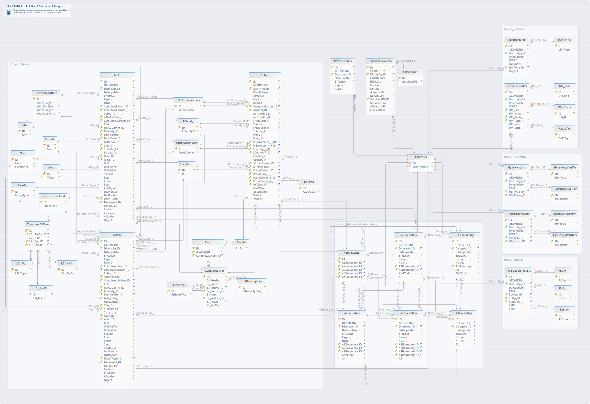

# NENA NG9-1-1 Relational Data Model Diagram v3.0

### NENA NG9-1-1 Relational Data Model ERD

README.md#table-ng911a1boundary
## Tables
1. [ng911.A1Boundary](#table-ng911a1boundary) 
2. [ng911.A1toA5Code](#table-ng911a1toa5code) 
3. [ng911.A2Boundary](#table-ng911a2boundary) 
4. [ng911.A3Boundary](#table-ng911a3boundary) 
5. [ng911.A4Boundary](#table-ng911a4boundary) 
6. [ng911.A5Boundary](#table-ng911a5boundary) 
7. [ng911.AdPoly](#table-ng911adpoly) 
8. [ng911.AdPt](#table-ng911adpt) 
9. [ng911.Alias](#table-ng911alias) 
10. [ng911.AliasSet](#table-ng911aliasset) 
11. [ng911.CompleteAdNum](#table-ng911completeadnum) 
12. [ng911.CompleteLStNam](#table-ng911completelstnam) 
13. [ng911.CompleteStNam](#table-ng911completestnam) 
14. [ng911.DiscrpAg](#table-ng911discrpag) 
15. [ng911.DistanceMarker](#table-ng911distancemarker) 
16. [ng911.DM_Route](#table-ng911dm\_route) 
17. [ng911.DM_Unit](#table-ng911dm\_unit) 
18. [ng911.Floor](#table-ng911floor) 
19. [ng911.HydrologyLine](#table-ng911hydrologyline) 
20. [ng911.HydrologyPolygon](#table-ng911hydrologypolygon) 
21. [ng911.HydrologyPolyNam](#table-ng911hydrologypolynam) 
22. [ng911.HydrologyPolyTyp](#table-ng911hydrologypolytyp) 
23. [ng911.HydrologySegNam](#table-ng911hydrologysegnam) 
24. [ng911.HydrologySegTyp](#table-ng911hydrologysegtyp) 
25. [ng911.LCounty](#table-ng911lcounty) 
26. [ng911.LocationMarker](#table-ng911locationmarker) 
27. [ng911.LSt_PosDir](#table-ng911lst\_posdir) 
28. [ng911.LSt_PreDir](#table-ng911lst\_predir) 
29. [ng911.LSt_Typ](#table-ng911lst\_typ) 
30. [ng911.MarkerTyp](#table-ng911markertyp) 
31. [ng911.MSAGCommunity](#table-ng911msagcommunity) 
32. [ng911.PlacementMethod](#table-ng911placementmethod) 
33. [ng911.PlaceTyp](#table-ng911placetyp) 
34. [ng911.PostalCode](#table-ng911postalcode) 
35. [ng911.PostalCommunity](#table-ng911postalcommunity) 
36. [ng911.ProvBoundary](#table-ng911provboundary) 
37. [ng911.RailroadCenterLine](#table-ng911railroadcenterline) 
38. [ng911.RdClass](#table-ng911rdclass) 
39. [ng911.RLNam](#table-ng911rlnam) 
40. [ng911.RLOp](#table-ng911rlop) 
41. [ng911.RLOwn](#table-ng911rlown) 
42. [ng911.RouteTyp](#table-ng911routetyp) 
43. [ng911.ServiceBoundary](#table-ng911serviceboundary) 
44. [ng911.ServiceURN](#table-ng911serviceurn) 
45. [ng911.Site](#table-ng911site) 
46. [ng911.StNamTyp](#table-ng911stnamtyp) 
47. [ng911.StNamTypSep](#table-ng911stnamtypsep) 
48. [ng911.StSeg](#table-ng911stseg) 
49. [ng911.Subsite](#table-ng911subsite) 
50. [ng911.Wing](#table-ng911wing) 

---
### Table ng911.A1Boundary 
A1 Boundary

|Idx |Name |Data Type |Description |
|---|---|---|---|
| * &#128273;  &#11019; | ID| BIGINT  | A1 Boundary ID |
|  | GEOMETRY| GEOMETRY(POLYGON)  | Geometry |
| * &#128273;  &#11016; | DiscrpAg\_ID| BIGINT  | Discrepancy Agency ID |
| * | DateUpdate| DATETIME  | Date Updated |
|  | Effective| DATETIME  | Effective Date |
|  | Expire| DATETIME  | Expiration Date |
| * | NGUID| TEXT(254)  | NENA Globally Unique ID |
| * | A1| TEXT(2)  | Administrative Level 1 |

##### Indexes 
|Type |Name |On |
|---|---|---|
| &#128273;  | pk\_A1Boundary | ON ID, DiscrpAg\_ID|
| &#128269;  | unq\_ID | ON ID|

##### Foreign Keys
|Type |Name |On |
|---|---|---|
|  | fk_A1Boundary_has_DiscrpAg | ( DiscrpAg\_ID ) ref [ng911.DiscrpAg](#table-ng911discrpag) (DiscrpAgID) |

---

### Table ng911.A1toA5Code 
A1 Through A5 Code

|Idx |Name |Data Type |Description |
|---|---|---|---|
| * &#128273;  &#11019; | ID| BIGINT  | A1 to A5 Code ID |
| * &#128273;  &#11016; | A1Boundary\_ID| BIGINT  | A1 Boundary ID |
| * &#128273;  &#11016; | A2Boundary\_ID| BIGINT  | A2 Boundary ID |
| * &#128273;  &#11016; | A3Boundary\_ID| BIGINT  | A3 Boundary ID |
| * &#128273;  &#11016; | A4Boundary\_ID| BIGINT  | A4 Boundary ID |
| * &#128273;  &#11016; | A5Boundary\_ID| BIGINT  | A5 Boundary ID |

##### Indexes 
|Type |Name |On |
|---|---|---|
| &#128273;  | pk\_A1toA5Code | ON ID, A1Boundary\_ID, A2Boundary\_ID, A3Boundary\_ID, A4Boundary\_ID, A5Boundary\_ID|
| &#128269;  | unq\_ID | ON ID|

##### Foreign Keys
|Type |Name |On |
|---|---|---|
|  | fk_A1toA5Code_has_A1Boundary | ( A1Boundary\_ID ) ref [ng911.A1Boundary](#table-ng911A1Boundary) (ID) |
|  | fk_A1toA5Code_has_A2Boundary | ( A2Boundary\_ID ) ref [ng911.A2Boundary](#table-ng911A2Boundary) (ID) |
|  | fk_A1toA5Code_has_A3Boundary | ( A3Boundary\_ID ) ref [ng911.A3Boundary](#table-ng911A3Boundary) (ID) |
|  | fk_A1toA5Code_has_A4Boundary | ( A4Boundary\_ID ) ref [ng911.A4Boundary](#table-ng911A4Boundary) (ID) |
|  | fk_A1toA5Code_has_A5Boundary | ( A5Boundary\_ID ) ref [ng911.A5Boundary](#table-ng911AA5Boundary) (ID) |

---
### Table ng911.A2Boundary 
A2 Boundary

|Idx |Name |Data Type |Description |
|---|---|---|---|
| * &#128273;  &#11019; | ID| BIGINT  | A2 Boundary ID |
|  | GEOMETRY| GEOMETRY(POLYGON)  | Geometry |
| * &#128273;  &#11016; | DiscrpAg\_ID| BIGINT  | Discrepancy Agency ID |
| * | DateUpdate| DATETIME  | Date Updated |
|  | Effective| DATETIME  | Effective Date |
|  | Expire| DATETIME  | Expiration Date |
| * | NGUID| TEXT(254)  | NENA Globally Unique ID |
| * &#128273;  &#11016; | A1Boundary\_ID| BIGINT  | A1 Boundary ID |
| * | A2| TEXT(254)  | Administrative Level 2 |
|  | AddCode| TEXT(6)  | Additional Code |

##### Indexes 
|Type |Name |On |
|---|---|---|
| &#128273;  | pk\_A2Boundary | ON ID, DiscrpAg\_ID, A1Boundary\_ID|
| &#128269;  | unq\_ID | ON ID|

##### Foreign Keys
|Type |Name |On |
|---|---|---|
|  | fk_A2Boundary_has_DiscrpAg | ( DiscrpAg\_ID ) ref [ng911.DiscrpAg](#table-ng911discrpag) (ID) |
|  | fk_A2Boundary_has_A1Boundary | ( A1Boundary\_ID ) ref [ng911.A1Boundary](#table-ng911A1Boundary) (ID) |

---
### Table ng911.A3Boundary 
A3 Boundary

|Idx |Name |Data Type |Description |
|---|---|---|---|
| * &#128273;  &#11019; | ID| BIGINT  | A3 Boundary ID |
|  | GEOMETRY| GEOMETRY(POLYGON)  | Geometry |
| * &#128273;  &#11016; | DiscrpAg\_ID| BIGINT  | Discrepancy Agency ID |
| * | DateUpdate| DATETIME  | Date Updated |
|  | Effective| DATETIME  | Effective Date |
|  | Expire| DATETIME  | Expiration Date |
| * | NGUID| TEXT(254)  | NENA Globally Unique ID |
| * &#128273;  &#11016; | A1Boundary\_ID| BIGINT  | A1 Boundary ID |
| * &#128273;  &#11016; | A2Boundary\_ID| BIGINT  | A2 Boundary ID |
|  | AddCode| TEXT(6)  | Additional Code |
| * | A3| TEXT(254)  | Administrative Level 3 |

##### Indexes 
|Type |Name |On |
|---|---|---|
| &#128273;  | pk\_A3Boundary | ON ID, DiscrpAg\_ID, A1Boundary\_ID, A2Boundary\_ID|
| &#128269;  | unq\_ID | ON ID|

##### Foreign Keys
|Type |Name |On |
|---|---|---|
|  | fk_A3Boundary_has_DiscrpAg | ( DiscrpAg\_ID ) ref [ng911.DiscrpAg](#table-ng911discrpag) (ID) |
|  | fk_A3Boundary_has_A1Boundary | ( A1Boundary\_ID ) ref [ng911.A1Boundary](#table-ng911A1Boundary) (ID) |
|  | fk_A3Boundary_has_A2Boundary | ( A2Boundary\_ID ) ref [ng911.A2Boundary](#table-ng911A2Boundary) (ID) |

---
### Table ng911.A4Boundary 
A4 Boundary

|Idx |Name |Data Type |Description |
|---|---|---|---|
| * &#128273;  &#11019; | ID| BIGINT  | A4 Boundary ID |
|  | GEOMETRY| GEOMETRY(POLYGON)  | Geometry |
| * &#128273;  &#11016; | DiscrpAg\_ID| BIGINT  | Discrepancy Agency ID |
| * | DateUpdate| DATETIME  | Date Updated |
|  | Effective| DATETIME  | Effective Date |
|  | Expire| DATETIME  | Expiration Date |
| * | NGUID| TEXT(254)  | NENA Globally Unique ID |
| * &#128273;  &#11016; | A1Boundary\_ID| BIGINT  | A1 Boundary ID |
| * &#128273;  &#11016; | A2Boundary\_ID| BIGINT  | A2 Boundary ID |
| * &#128273;  &#11016; | A3Boundary\_ID| BIGINT  | A3 Boundary ID |
|  | AddCode| TEXT(6)  | Additional Code |
| * | A4| TEXT(254)  | Administrative Level 4 |

##### Indexes 
|Type |Name |On |
|---|---|---|
| &#128273;  | pk\_A4Boundary | ON ID, DiscrpAg\_ID, A1Boundary\_ID, A2Boundary\_ID, A3Boundary\_ID|
| &#128269;  | unq\_ID | ON ID|

##### Foreign Keys
|Type |Name |On |
|---|---|---|
|  | fk_A4Boundary_has_DiscrpAg | ( DiscrpAg\_ID ) ref [ng911.DiscrpAg](#table-ng911discrpag) (ID) |
|  | fk_A4Boundary_has_A1Boundary | ( A1Boundary\_ID ) ref [ng911.A1Boundary](#table-ng911A1Boundary) (ID) |
|  | fk_A4Boundary_has_A2Boundary | ( A2Boundary\_ID ) ref [ng911.A2Boundary](#table-ng911A2Boundary) (ID) |
|  | fk_A4Boundary_has_A3Boundary | ( A3Boundary\_ID ) ref [ng911.A3Boundary](#table-ng911A3Boundary) (ID) |

---
### Table ng911.A5Boundary 
A5 Boundary

|Idx |Name |Data Type |Description |
|---|---|---|---|
| * &#128273;  &#11019; | ID| BIGINT  | A5 Boundary ID |
|  | GEOMETRY| GEOMETRY(POLYGON)  | Geometry |
| * &#128273;  &#11016; | DiscrpAg\_ID| BIGINT  | Discrepancy Agency ID |
| * | DateUpdate| DATETIME  | Date Updated |
|  | Effective| DATETIME  | Effective Date |
|  | Expire| DATETIME  | Expiration Date |
| * | NGUID| TEXT(254)  | NENA Globally Unique ID |
| * &#128273;  &#11016; | A1Boundary\_ID| BIGINT  | A1 Boundary ID |
| * &#128273;  &#11016; | A2Boundary\_ID| BIGINT  | A2 Boundary ID |
| * &#128273;  &#11016; | A3Boundary\_ID| BIGINT  | A3 Boundary ID |
| * &#128273;  &#11016; | A4Boundary\_ID| BIGINT  | A4 Boundary ID |
| * | A5| TEXT(254)  | Administrative Level 5 |

##### Indexes 
|Type |Name |On |
|---|---|---|
| &#128273;  | pk\_A5Boundary | ON ID, DiscrpAg\_ID, A1Boundary\_ID, A2Boundary\_ID, A3Boundary\_ID, A4Boundary\_ID|
| &#128269;  | unq\_ID | ON ID|

##### Foreign Keys
|Type |Name |On |
|---|---|---|
|  | fk_A5Boundary_has_DiscrpAg | ( DiscrpAg\_ID ) ref [ng911.DiscrpAg](#table-ng911discrpag) (ID) |
|  | fk_A5Boundary_has_A1Boundary | ( A1Boundary\_ID ) ref [ng911.A1Boundary](#table-ng911A1Boundary) (ID) |
|  | fk_A5Boundary_has_A2Boundary | ( A2Boundary\_ID ) ref [ng911.A2Boundary](#table-ng911A2Boundary) (ID) |
|  | fk_A5Boundary_has_A3Boundary | ( A3Boundary\_ID ) ref [ng911.A3Boundary](#table-ng911A3Boundary) (ID) |
|  | fk_A5Boundary_has_A4Boundary | ( A4Boundary\_ID ) ref [ng911.A4Boundary](#table-ng911A4Boundary) (ID) |

---
### Table ng911.AdPoly 
Site/Structure Address Polygon

|Idx |Name |Data Type |Description |
|---|---|---|---|
| * &#128273;  | ID| BIGINT  | Site/Structure Address Point ID |
|  | GEOMETRY| GEOMETRY(POLYGON)  | Geometry |
| * &#128273;  &#11016; | DiscrpAg\_ID| BIGINT  | Discrepancy Agency ID |
| * | DateUpdate| DATETIME  | Date Updated |
|  | Effective| DATETIME  | Effective Date |
|  | Expire| DATETIME  | Expiration Date |
| * | NGUID| TEXT(254)  | NENA Globally Unique ID |
| * &#128273;  &#11016; | CompleteStNam\_ID| BIGINT  | Complete Street Name ID |
| * &#128273;  &#11016; | CompleteAdNum\_ID| BIGINT  | Complete Address Number ID |
|  | StSeg\_ID| BIGINT  | Street Segment ID |
| * &#128273;  &#11016; | A1toA5Code\_ID| BIGINT  | A1 to A5 Code ID |
| * &#128273;  &#11016; | CompleteLStNam\_ID| BIGINT  | Complete Legacy Street Name ID |
|  | ESN| TEXT(5)  | ESN |
| * &#128273;  &#11016; | MSAGComm\_ID| BIGINT  | MSAG Community Name ID |
| * &#128273;  &#11016; | LCounty\_ID| BIGINT  | Legacy County ID |
| * &#128273;  &#11016; | Post\_Comm\_ID| BIGINT  | Postal Community Name ID |
| * &#128273;  &#11016; | Post\_Code\_ID| BIGINT  | Postal Code ID |
|  | PostCodeEx| TEXT(4)  | Postal Code Extension |
| * &#128273;  &#11016; | Site\_ID| BIGINT  | Site ID |
| * &#128273;  &#11016; | SubSite\_ID| BIGINT  | Subsite ID |
|  | Structure| TEXT(75)  | Structure |
| * &#128273;  &#11016; | Floor\_ID| BIGINT  | Floor ID |
| * &#128273;  &#11016; | Wing\_ID| BIGINT  | Wing ID |
|  | Unit| TEXT(75)  | Unit (Canada Only) |
|  | UnitPreTyp| TEXT(75)  | Unit Pre-Type (USA Only) |
|  | UnitValue| TEXT(75)  | Unit Value (USA Only) |
|  | Section| TEXT(75)  | Section |
|  | Row| TEXT(75)  | Row |
|  | Room| TEXT(75)  | Room |
|  | Seat| TEXT(75)  | Seat |
|  | Addtl\_Loc| TEXT(225)  | Additional Location Information |
|  | LocMarker| TEXT(100)  | Location Marker |
|  | DisMarker| TEXT(150)  | Distance Marker |
| * &#128273;  &#11016; | Place\_Type\_ID| BIGINT  | Place Type ID |
| * &#128273;  &#11016; | Placement\_ID| BIGINT  | Placement Method ID |
|  | Longitude| REAL(11,7)  | Longitude |
|  | Latitude| REAL(10,7)  | Latitude |
|  | Elevation| REAL(9,3)  | Elevation |
|  | Altitude| REAL(9,3)  | Altitude |
|  | Height| REAL(9,3)  | Height |

##### Indexes 
|Type |Name |On |
|---|---|---|
| &#128273;  | pk\_AdPoly | ON ID, CompleteAdNum\_ID, CompleteStNam\_ID, Placement\_ID, Place\_Type\_ID, Wing\_ID, Floor\_ID, SubSite\_ID, Site\_ID, Post\_Code\_ID, Post\_Comm\_ID, LCounty\_ID, MSAGComm\_ID, CompleteLStNam\_ID, A1toA5Code\_ID, DiscrpAg\_ID|

##### Foreign Keys
|Type |Name |On |
|---|---|---|
|  | fk_AdPoly_has_CompleteAdNum | ( CompleteAdNum\_ID ) ref [ng911.CompleteAdNum](#table-ng911CompleteAdNum) (ID) |
|  | fk_AdPoly_has_CompleteStNam | ( CompleteStNam\_ID ) ref [ng911.CompleteStNam](#table-ng911CompleteStNam) (ID) |
|  | fk_AdPoly_has_PlacementMethod | ( Placement\_ID ) ref [ng911.PlacementMethod](#table-ng911PlacementMethod) (ID) |
|  | fk_AdPoly_has_PlaceTyp | ( Place\_Type\_ID ) ref [ng911.PlaceTyp](#table-ng911PlaceTyp) (ID) |
|  | fk_AdPoly_has_Wing | ( Wing\_ID ) ref [ng911.Wing](#table-ng911Wing) (ID) |
|  | fk_AdPoly_has_Floor | ( Floor\_ID ) ref [ng911.Floor](#table-ng911Floor) (ID) |
|  | fk_AdPoly_has_Subsite | ( SubSite\_ID ) ref [ng911.Subsite](#table-ng911Subsite) (ID) |
|  | fk_AdPoly_has_Site | ( Site\_ID ) ref [ng911.Site](#table-ng911Site) (ID) |
|  | fk_AdPoly_has_PostalCode | ( Post\_Code\_ID ) ref [ng911.PostalCode](#table-ng911PostalCode) (ID) |
|  | fk_AdPoly_has_PostalCommunity | ( Post\_Comm\_ID ) ref [ng911.PostalCommunity](#table-ng911PostalCommunity) (ID) |
|  | fk_AdPoly_has_LCounty | ( LCounty\_ID ) ref [ng911.LCounty](#table-ng911LCounty) (ID) |
|  | fk_AdPoly_has_MSAGCommunity | ( MSAGComm\_ID ) ref [ng911.MSAGCommunity](#table-ng911MSAGCommunity) (ID) |
|  | fk_AdPoly_has_CompleteLStNam | ( CompleteLStNam\_ID ) ref [ng911.CompleteLStNam](#table-ng911CompleteLStNam) (ID) |
|  | fk_AdPoly_has_A1toA5Code | ( A1toA5Code\_ID ) ref [ng911.A1toA5Code](#table-ng911A1toA5Code) (ID) |
|  | fk_AdPoly_has_DiscrpAg | ( DiscrpAg\_ID ) ref [ng911.DiscrpAg](#table-ng911discrpag) (ID) |

---
### Table ng911.AdPt 
Site/Structure Address Point

|Idx |Name |Data Type |Description |
|---|---|---|---|
| * &#128273;  | ID| BIGINT  | Site/Structure Address Point ID |
|  | GEOMETRY| GEOMETRY(POINT)  | Geometry |
| * &#128273;  &#11016; | DiscrpAg\_ID| BIGINT  | Discrepancy Agency ID |
| * | DateUpdate| DATETIME  | Date Updated |
|  | Effective| DATETIME  | Effective Date |
|  | Expire| DATETIME  | Expiration Date |
| * | NGUID| TEXT(254)  | NENA Globally Unique ID |
| * &#128273;  &#11016; | CompleteStNam\_ID| BIGINT  | Complete Street Name ID |
| * &#128273;  &#11016; | CompleteAdNum\_ID| BIGINT  | Complete Address Number ID |
|  | StSeg\_ID| BIGINT  | Street Segment ID |
| * &#128273;  &#11016; | A1toA5Code\_ID| BIGINT  | A1 to A5 Code ID |
| * &#128273;  &#11016; | CompleteLStNam\_ID| BIGINT  | Complete Legacy Street Name ID |
|  | ESN| TEXT(5)  | ESN |
| * &#128273;  &#11016; | MSAGComm\_ID| BIGINT  | MSAG Community Name ID |
| * &#128273;  &#11016; | LCounty\_ID| BIGINT  | Legacy County ID |
| * &#128273;  &#11016; | Post\_Comm\_ID| BIGINT  | Postal Community Name ID |
| * &#128273;  &#11016; | Post\_Code\_ID| BIGINT  | Postal Code ID |
|  | PostCodeEx| TEXT(4)  | Postal Code Extension |
| * &#128273;  &#11016; | Site\_ID| BIGINT  | Site ID |
| * &#128273;  &#11016; | SubSite\_ID| BIGINT  | Subsite ID |
|  | Structure| TEXT(75)  | Structure |
| * &#128273;  &#11016; | Floor\_ID| BIGINT  | Floor ID |
| * &#128273;  &#11016; | Wing\_ID| BIGINT  | Wing ID |
|  | Unit| TEXT(75)  | Unit (Canada Only) |
|  | UnitPreTyp| TEXT(75)  | Unit Pre-Type (USA Only) |
|  | UnitValue| TEXT(75)  | Unit Value (USA Only) |
|  | Section| TEXT(75)  | Section |
|  | Row| TEXT(75)  | Row |
|  | Room| TEXT(75)  | Room |
|  | Seat| TEXT(75)  | Seat |
|  | Addtl\_Loc| TEXT(225)  | Additional Location Information |
|  | LocMarker| TEXT(100)  | Location Marker |
|  | DisMarker| TEXT(150)  | Distance Marker |
| * &#128273;  &#11016; | Place\_Type\_ID| BIGINT  | Place Type ID |
| * &#128273;  &#11016; | Placement\_ID| BIGINT  | Placement Method ID |
|  | Longitude| REAL(11,7)  | Longitude |
|  | Latitude| REAL(10,7)  | Latitude |
|  | Elevation| REAL(9,3)  | Elevation |
|  | Altitude| REAL(9,3)  | Altitude |
|  | Height| REAL(9,3)  | Height |

##### Indexes 
|Type |Name |On |
|---|---|---|
| &#128273;  | pk\_AdPt | ON ID, CompleteAdNum\_ID, CompleteStNam\_ID, Placement\_ID, Place\_Type\_ID, Wing\_ID, Floor\_ID, SubSite\_ID, Site\_ID, Post\_Code\_ID, Post\_Comm\_ID, LCounty\_ID, MSAGComm\_ID, CompleteLStNam\_ID, A1toA5Code\_ID, DiscrpAg\_ID|

##### Foreign Keys
|Type |Name |On |
|---|---|---|
|  | fk_AdPt_has_DiscrpAg | ( DiscrpAg\_ID ) ref [ng911.DiscrpAg](#table-ng911discrpag) (ID) |
|  | fk_AdPt_has_CompleteStNam | ( CompleteStNam\_ID ) ref [ng911.CompleteStNam](#table-ng911CompleteStNam) (ID) |
|  | fk_AdPt_has_CompleteAdNum | ( CompleteAdNum\_ID ) ref [ng911.CompleteAdNum](#table-ng911CompleteAdNum) (ID) |
|  | fk_AdPt_has_A1toA5Code | ( A1toA5Code\_ID ) ref [ng911.A1toA5Code](#table-ng911A1toA5Code) (ID) |
|  | fk_AdPt_has_CompleteLStNam | ( CompleteLStNam\_ID ) ref [ng911.CompleteLStNam](#table-ng911CompleteLStNam) (ID) |
|  | fk_AdPt_has_MSAGCommunity | ( MSAGComm\_ID ) ref [ng911.MSAGCommunity](#table-ng911MSAGCommunity) (ID) |
|  | fk_AdPt_has_LCounty | ( LCounty\_ID ) ref [ng911.LCounty](#table-ng911LCounty) (ID) |
|  | fk_AdPt_has_PostalCommunity | ( Post\_Comm\_ID ) ref [ng911.PostalCommunity](#table-ng911PostalCommunity) (ID) |
|  | fk_AdPt_has_PostalCode | ( Post\_Code\_ID ) ref [ng911.PostalCode](#table-ng911PostalCode) (ID) |
|  | fk_AdPt_has_Site | ( Site\_ID ) ref [ng911.Site](#table-ng911Site) (ID) |
|  | fk_AdPt_has_Subsite | ( SubSite\_ID ) ref [ng911.Subsite](#table-ng911Subsite) (ID) |
|  | fk_AdPt_has_Floor | ( Floor\_ID ) ref [ng911.Floor](#table-ng911Floor) (ID) |
|  | fk_AdPt_has_Wing | ( Wing\_ID ) ref [ng911.Wing](#table-ng911Wing) (ID) |
|  | fk_AdPt_has_PlaceTyp | ( Place\_Type\_ID ) ref [ng911.PlaceTyp](#table-ng911PlaceTyp) (ID) |
|  | fk_AdPt_has_PlacementMethod | ( Placement\_ID ) ref [ng911.PlacementMethod](#table-ng911PlacementMethod) (ID) |

---
### Table ng911.Alias 
Alias

|Idx |Name |Data Type |Description |
|---|---|---|---|
| * &#128273;  | ID| BIGINT  | Alias ID |
| * &#128273;  &#11016; | AliasSet\_ID| BIGINT  | Alias Set ID |
| * &#128273;  &#11016; | CompleteStNam\_ID| BIGINT  | Complete Street Name ID |

##### Indexes 
|Type |Name |On |
|---|---|---|
| &#128273;  | pk\_Alias | ON ID, AliasSet\_ID, CompleteStNam\_ID|
| &#128269;  | unq\_ID | ON ID|

##### Foreign Keys
|Type |Name |On |
|---|---|---|
|  | fk_Alias_has_AliasSet | ( AliasSet\_ID ) ref [ng911.AliasSet](#table-ng911AliasSet) (ID) |
|  | fk_Alias_has_CompleteStNam | ( CompleteStNam\_ID ) ref [ng911.CompleteStNam](#table-ng911CompleteStNam) (ID) |

---
### Table ng911.AliasSet 
Alias Set

|Idx |Name |Data Type |Description |
|---|---|---|---|
| * &#128273;  &#11019; | ID| BIGINT  | Alias Set ID |

##### Indexes 
|Type |Name |On |
|---|---|---|
| &#128273;  | pk\_AliasSet | ON ID|

---
### Table ng911.CompleteAdNum 
Complete Address Number

|Idx |Name |Data Type |Description |
|---|---|---|---|
| * &#128273;  &#11019; | ID| BIGINT  | Complete Address Number ID |
|  | AddNum\_Pre| TEXT(15)  | Address Number Prefix |
|  | Add\_Number| INTEGER  | Address Number |
|  | AddNum\_Suf| TEXT(15)  | Adress Number Suffix |
|  | AddNum\_Cmp| TEXT(42)  | Address Number Complete |

##### Indexes 
|Type |Name |On |
|---|---|---|
| &#128273;  | pk\_CompleteAdNum | ON ID|

---
### Table ng911.CompleteLStNam 
Complete Legacy Street Name

|Idx |Name |Data Type |Description |
|---|---|---|---|
| * &#128273;  &#11019; | ID| BIGINT  | Complete Legacy Street Name ID |
| * &#128273;  &#11016; | LSt\_PreDir\_ID| BIGINT  | Legacy Street Name Pre Directional ID |
|  | LSt\_Nam| TEXT(75)  | Legacy Street Name |
| * &#128273;  &#11016; | LSt\_Typ\_ID| BIGINT  | Legacy Street Name Type ID |
| * &#128273;  &#11016; | LSt\_PosDir\_ID| BIGINT  | Legacy Street Name Post Directional ID |

##### Indexes 
|Type |Name |On |
|---|---|---|
| &#128273;  | pk\_CompleteLStNam | ON ID, LSt\_PreDir\_ID, LSt\_Typ\_ID, LSt\_PosDir\_ID|
| &#128269;  | unq\_ID | ON ID|

##### Foreign Keys
|Type |Name |On |
|---|---|---|
|  | fk_CompleteLStNam_has_LSt_PreDir | ( LSt\_PreDir\_ID ) ref [ng911.LSt\_PreDir](#table-ng911LSt_PreDir) (ID) |
|  | fk_CompleteLStNam_has_LSt_Typ | ( LSt\_Typ\_ID ) ref [ng911.LSt\_Typ](#table-ng911LSt_Typ) (ID) |
|  | fk_CompleteLStNam_has_LSt_PosDir | ( LSt\_PosDir\_ID ) ref [ng911.LSt\_PosDir](#table-ng911LSt_PosDir) (ID) |

---
### Table ng911.CompleteStNam 
Complete Street Name

|Idx |Name |Data Type |Description |
|---|---|---|---|
| * &#128273;  &#11019; | ID| BIGINT  | Complete Street Name ID |
|  | St\_PreMod| TEXT(25)  | Street Name Pre Modifier |
|  | St\_PreDir| TEXT(10)  | Street Name Pre Directional |
| * &#128273;  &#11016; | St\_PreTyp\_ID| BIGINT  | Street Name Pre Type ID |
| * &#128273;  &#11016; | St\_PreSep\_ID| BIGINT  | Street Name Pre Type Separator ID |
| * | St\_Nam| TEXT(254)  | Street Name |
| * &#128273;  &#11016; | St\_PosTyp\_ID| BIGINT  | Street Name Post Type ID |
|  | St\_PosDir| BIGINT  | Street Name Post Directional |
|  | St\_PosMod| TEXT(25)  | Street Name Post Modifier |

##### Indexes 
|Type |Name |On |
|---|---|---|
| &#128273;  | pk\_CompleteStNam | ON ID, St\_PreTyp\_ID, St\_PosTyp\_ID, St\_PreSep\_ID|
| &#128269;  | unq\_ID | ON ID|

##### Foreign Keys
|Type |Name |On |
|---|---|---|
|  | fk_CompleteStNam_has_StNamTypSep | ( St\_PreSep\_ID ) ref [ng911.StNamTypSep](#table-ng911StNamTypSep) (ID) |
|  | fk_CompleteStNam_has_StNamTypPre | ( St\_PreTyp\_ID ) ref [ng911.StNamTyp](#table-ng911StNamTyp) (ID) |
|  | fk_CompleteStNam_has_StNamTypPost | ( St\_PosTyp\_ID ) ref [ng911.StNamTyp](#table-ng911StNamTyp) (ID) |

---
### Table ng911.DM_Route 
Distance Marker Route

|Idx |Name |Data Type |Description |
|---|---|---|---|
| * &#128273;  &#11019; | ID| BIGINT  | Distance Marker Route ID |
| * | DM\_Rte| TEXT(50)  | Distance Marker Route Name |

##### Indexes 
|Type |Name |On |
|---|---|---|
| &#128273;  | pk\_DM\_Route | ON ID|

---
### Table ng911.DM_Unit 
Distance Marker Unit of Measure

|Idx |Name |Data Type |Description |
|---|---|---|---|
| * &#128273;  &#11019; | ID| BIGINT  | Distance Marker Unit of Measure ID |
| * | DM\_Unit| TEXT(15)  | Distance Marker Unit of Measure |

##### Indexes 
|Type |Name |On |
|---|---|---|
| &#128273;  | pk\_DM\_Unit | ON ID|

---
### Table ng911.DiscrpAg 
Discrepancy Agency

|Idx |Name |Data Type |Description |
|---|---|---|---|
| * &#128273;  &#11019; | ID| BIGINT  | Discrepancy Agency ID |
| * &#128269; &#11019; | DiscrpAgID| TEXT(100)  | Discrepancy Agency ID |

##### Indexes 
|Type |Name |On |
|---|---|---|
| &#128273;  | pk\_DiscrpAg | ON ID|
| &#128269;  | unq\_DiscrpAgID | ON DiscrpAgID|

---
### Table ng911.DistanceMarker 
Distance Marker

|Idx |Name |Data Type |Description |
|---|---|---|---|
| * &#128273;  | ID| BIGINT  | Distance Marker ID |
| * | GEOMETRY| GEOMETRY(POINT)  | Geometry |
| * &#128273;  &#11016; | DiscrpAg\_ID| BIGINT  | Discrepancy Agency ID |
| * | DateUpdate| DATETIME  | Date Updated |
| * | NGUID| TEXT(254)  | NENA Globally Unique ID |
| * &#128273;  &#11016; | DM\_Unit| BIGINT  | Distance Marker Unit of Measurement |
| * | DM\_Value| REAL(9,3)  | Distance Marker Measurement Value |
| * &#128273;  &#11016; | DM\_Route\_ID| BIGINT  | Distance Marker Route ID |
| * &#128273;  &#11016; | DM\_Type\_ID| BIGINT  | Distance Marker Route Type ID |
| * | DM\_Ind| TEXT(1)  | Distance Marker Indicator |
|  | DM\_Label| TEXT(100)  | Distance Marker Label |

##### Indexes 
|Type |Name |On |
|---|---|---|
| &#128273;  | pk\_template\_1 | ON ID, DiscrpAg\_ID, DM\_Unit, DM\_Route\_ID, DM\_Type\_ID|

##### Foreign Keys
|Type |Name |On |
|---|---|---|
|  | fk_DistanceMarker_has_DiscrpAg | ( DiscrpAg\_ID ) ref [ng911.DiscrpAg](#table-ng911discrpag) (ID) |
|  | fk_DistanceMarker_has_Unit | ( DM\_Unit ) ref [ng911.DM\_Unit](#table-ng911DM_Unit) (ID) |
|  | fk_DistanceMarker_has_Route | ( DM\_Route\_ID ) ref [ng911.DM\_Route](#table-ng911DM_Route) (ID) |
|  | fk_DistanceMarker_has_RouteTyp | ( DM\_Type\_ID ) ref [ng911.RouteTyp](#table-ng911RouteTyp) (ID) |

---
### Table ng911.Floor 
Floor

|Idx |Name |Data Type |Description |
|---|---|---|---|
| * &#128273;  &#11019; | ID| BIGINT  | Floor ID |
|  | Floor| TEXT(75)  | Floor Label |
|  | FloorIndex| INTEGER  | Floor Index |

##### Indexes 
|Type |Name |On |
|---|---|---|
| &#128273;  | pk\_Floor | ON ID|

---
### Table ng911.HydrologyLine 
Hydrology Line

|Idx |Name |Data Type |Description |
|---|---|---|---|
| * &#128273;  | ID| BIGINT  | Hydrology Line ID |
| * | GEOMETRY| GEOMETRY(LINESTRING)  | Geometry |
| * &#128273;  &#11016; | DiscrpAg\_ID| BIGINT  | Discrepancy Agency ID |
| * | DateUpdate| DATETIME  | Date Updated |
| * | NGUID| TEXT(254)  | NENA Globally Unique ID |
| * &#128273;  &#11016; | HS\_Type\_ID| BIGINT  | Hydrology Segment Type ID |
| * &#128273;  &#11016; | HS\_Name\_ID| BIGINT  | Hydrology Segment Name ID |

##### Indexes 
|Type |Name |On |
|---|---|---|
| &#128273;  | pk\_HydrologyLine | ON ID, DiscrpAg\_ID, HS\_Type\_ID, HS\_Name\_ID|

##### Foreign Keys
|Type |Name |On |
|---|---|---|
|  | fk_HydrologyLine_has_DiscrpAg | ( DiscrpAg\_ID ) ref [ng911.DiscrpAg](#table-ng911discrpag) (ID) |
|  | fk_HydrologyLine_has_HydrologySegTyp | ( HS\_Type\_ID ) ref [ng911.HydrologySegTyp](#table-ng911HydrologySegTyp) (ID) |
|  | fk_HydrologyLine_has_HydrologySegNam | ( HS\_Name\_ID ) ref [ng911.HydrologySegNam](#table-ng911HydrologySegNam) (ID) |

---
### Table ng911.HydrologyPolyNam 
Hydrology Polygon Name

|Idx |Name |Data Type |Description |
|---|---|---|---|
| * &#128273;  &#11019; | ID| BIGINT  | Hydrology Polygon Name ID |
| * | HS\_Name| TEXT(100)  | Hydrology Polygon Name |

##### Indexes 
|Type |Name |On |
|---|---|---|
| &#128273;  | pk\_HydrologyPolyNam | ON ID|

---
### Table ng911.HydrologyPolyTyp 
Hydrology Polygon Type

|Idx |Name |Data Type |Description |
|---|---|---|---|
| * &#128273;  &#11019; | ID| BIGINT  | Hydrology Polygon Type ID |
| * | HP\_Type| TEXT(100)  | Hydrology Polygon Type Name |

##### Indexes 
|Type |Name |On |
|---|---|---|
| &#128273;  | pk\_HydrologyPolyTyp | ON ID|

---
### Table ng911.HydrologyPolygon 
Hydrology Polygons

|Idx |Name |Data Type |Description |
|---|---|---|---|
| * &#128273;  | ID| BIGINT  | Hydrology Polygon ID |
| * | GEOMETRY| GEOMETRY(POLYGON)  | Geometry |
| * &#128273;  &#11016; | DiscrpAg\_ID| BIGINT  | Discrepancy Agency ID |
| * | DateUpdate| DATETIME  | Date Updated |
| * | NGUID| TEXT(254)  | NENA Globally Unique ID |
| * &#128273;  &#11016; | HP\_Type\_ID| BIGINT  | Hydrology Polygon Type ID |
| * &#128273;  &#11016; | HP\_Name\_ID| BIGINT  | Hydrology Polygon Name ID |

##### Indexes 
|Type |Name |On |
|---|---|---|
| &#128273;  | pk\_HydrologyPolygon | ON ID, DiscrpAg\_ID, HP\_Type\_ID, HP\_Name\_ID|

##### Foreign Keys
|Type |Name |On |
|---|---|---|
|  | fk_HydrologyPolygon_has_DiscrpAg | ( DiscrpAg\_ID ) ref [ng911.DiscrpAg](#table-ng911discrpag) (ID) |
|  | fk_HydrologyPolygon_has_HydrologyPolyTyp | ( HP\_Type\_ID ) ref [ng911.HydrologyPolyTyp](#table-ng911HydrologyPolyTyp) (ID) |
|  | fk_HydrologyPolygon_has_HydrologyPolyNam | ( HP\_Name\_ID ) ref [ng911.HydrologyPolyNam](#table-ng911HydrologyPolyNam) (ID) |

---
### Table ng911.HydrologySegNam 
Hydrology Segment Name

|Idx |Name |Data Type |Description |
|---|---|---|---|
| * &#128273;  &#11019; | ID| BIGINT  | Hydrology Segment Name ID |
| * | HS\_Name| TEXT(100)  | Hydrology Segment Name |

##### Indexes 
|Type |Name |On |
|---|---|---|
| &#128273;  | pk\_HydrologySegNam | ON ID|

---
### Table ng911.HydrologySegTyp 
Hydrology Segment Type

|Idx |Name |Data Type |Description |
|---|---|---|---|
| * &#128273;  &#11019; | ID| BIGINT  | Hydrology Segment Type ID |
|  | HS\_Type| TEXT(100)  | Hydrology Segment Type Name |

##### Indexes 
|Type |Name |On |
|---|---|---|
| &#128273;  | pk\_HydrologySegTyp | ON ID|

---
### Table ng911.LCounty 
Legacy County

|Idx |Name |Data Type |Description |
|---|---|---|---|
| * &#128273;  &#11019; | ID| BIGINT  | Legacy County ID |
| * | LCountyID| TEXT(5)  | Legacy County ID |

##### Indexes 
|Type |Name |On |
|---|---|---|
| &#128273;  | pk\_LCounty | ON ID|

---
### Table ng911.LSt_PosDir 
Legacy Street Name Post Directional

|Idx |Name |Data Type |Description |
|---|---|---|---|
| * &#128273;  &#11019; | ID| BIGINT  | Legacy Street Name Post Directional ID |
|  | LSt\_PostDir| TEXT(2)  | Legacy Street Name Post Directional |

##### Indexes 
|Type |Name |On |
|---|---|---|
| &#128273;  | pk\_LSt\_PosDir | ON ID|

---
### Table ng911.LSt_PreDir 
Legacy Street Name Pre Directional

|Idx |Name |Data Type |Description |
|---|---|---|---|
| * &#128273;  &#11019; | ID| BIGINT  | Legacy Street Name Pre Directional ID |
| * | LSt\_PreDir| TEXT(2)  | Legacy Street Name Pre Directional |

##### Indexes 
|Type |Name |On |
|---|---|---|
| &#128273;  | pk\_LSt\_PreDir | ON ID|

---
### Table ng911.LSt_Typ 
Legacy Street Name Type

|Idx |Name |Data Type |Description |
|---|---|---|---|
| * &#128273;  &#11019; | ID| BIGINT  | Legacy Street Name Type ID |
| * | LSt\_Type| TEXT(4)  | Legacy Street Name Type |

##### Indexes 
|Type |Name |On |
|---|---|---|
| &#128273;  | pk\_LSt\_Typ | ON ID|

---
### Table ng911.LocationMarker 
Location Marker

|Idx |Name |Data Type |Description |
|---|---|---|---|
| * &#128273;  | ID| BIGINT  | Location Marker ID |
| * | GEOMETRY| GEOMETRY(POINT)  | Geometry |
| * &#128273;  &#11016; | DiscrpAg\_ID| BIGINT  | Discrepancy Agency ID |
| * | DateUpdate| DATETIME  | Date Updated |
| * | NGUID| TEXT(254)  | NENA Globally Unique ID |
| * | LM\_Label| TEXT(100)  | Location Marker Label |
| * &#128273;  &#11016; | LM\_Type\_ID| BIGINT  | Location Marker Type ID |
| * | LM\_Ind| TEXT(1)  | Location Marker Indicator |

##### Indexes 
|Type |Name |On |
|---|---|---|
| &#128273;  | pk\_LocationMarker | ON ID, DiscrpAg\_ID, LM\_Type\_ID|

##### Foreign Keys
|Type |Name |On |
|---|---|---|
|  | fk_LocationMarker_has_DiscrpAg | ( DiscrpAg\_ID ) ref [ng911.DiscrpAg](#table-ng911discrpag) (ID) |
|  | fk_LocationMarker_has_MarkerTyp | ( LM\_Type\_ID ) ref [ng911.MarkerTyp](#table-ng911MarkerTyp) (ID) |

---
### Table ng911.MSAGCommunity 
MSAG Community Name

|Idx |Name |Data Type |Description |
|---|---|---|---|
| * &#128273;  &#11019; | ID| BIGINT  | MSAG Community ID |
| * | MSAGComm| TEXT(25)  | MSAG Community Name |

##### Indexes 
|Type |Name |On |
|---|---|---|
| &#128273;  | pk\_MSAGCommunity | ON ID|

---
### Table ng911.MarkerTyp 
Location Marker Type

|Idx |Name |Data Type |Description |
|---|---|---|---|
| * &#128273;  &#11019; | ID| BIGINT  | Location Marker Type ID |
| * | LM\_Type| TEXT(50)  | Location Marker Type |

##### Indexes 
|Type |Name |On |
|---|---|---|
| &#128273;  | pk\_MarkerTyp | ON ID|

---
### Table ng911.PlaceTyp 
Place Type

|Idx |Name |Data Type |Description |
|---|---|---|---|
| * &#128273;  &#11019; | ID| BIGINT  | Place Type ID |
| * | Place\_Type| TEXT(50)  | Place Type |

##### Indexes 
|Type |Name |On |
|---|---|---|
| &#128273;  | pk\_PlaceTyp | ON ID|

---
### Table ng911.PlacementMethod 
Placement Method

|Idx |Name |Data Type |Description |
|---|---|---|---|
| * &#128273;  &#11019; | ID| BIGINT  | Placement Method ID |
| * | Placement| TEXT(50)  | Placement Method |

##### Indexes 
|Type |Name |On |
|---|---|---|
| &#128273;  | pk\_PlacementMethod | ON ID|

---
### Table ng911.PostalCode 
Postal Code

|Idx |Name |Data Type |Description |
|---|---|---|---|
| * &#128273;  &#11019; | ID| BIGINT  | Postal Code ID |
| * | PC| TEXT(7)  | Postal Code |

##### Indexes 
|Type |Name |On |
|---|---|---|
| &#128273;  | pk\_PostalCode | ON ID|

---
### Table ng911.PostalCommunity 
Postal Community Name

|Idx |Name |Data Type |Description |
|---|---|---|---|
| * &#128273;  &#11019; | ID| BIGINT  | Postal Community ID |
| * | PostalComm| TEXT(25)  | Postal Community Name |

##### Indexes 
|Type |Name |On |
|---|---|---|
| &#128273;  | pk\_PostalCommunity | ON ID|

---
### Table ng911.ProvBoundary 
Provisioning Boundary

|Idx |Name |Data Type |Description |
|---|---|---|---|
| * &#128273;  | ID| BIGINT  | Provisioning Boundary ID |
| * | GEOMETRY| GEOMETRY(POLYGON)  | Geometry |
| * &#128273;  &#11016; | DiscrpAg\_ID| BIGINT  | Discrepancy Agency ID |
| * | DateUpdate| DATETIME  | Date Updated |
|  | Effective| DATETIME  | Effective Date |
|  | Expire| DATETIME  | Expiration Date |
| * | NGUID| TEXT(254)  | NENA Globally Unique ID |

##### Indexes 
|Type |Name |On |
|---|---|---|
| &#128273;  | pk\_ProvBoundary | ON ID, DiscrpAg\_ID|

##### Foreign Keys
|Type |Name |On |
|---|---|---|
|  | fk_ProvBoundary_has_DiscrpAg | ( DiscrpAg\_ID ) ref [ng911.DiscrpAg](#table-ng911discrpag) (ID) |

---
### Table ng911.RLNam 
Rail Line Name

|Idx |Name |Data Type |Description |
|---|---|---|---|
| * &#128273;  &#11019; | ID| BIGINT  | Rail Line Name ID |
| * | RLName| TEXT(100)  | Rail Line Name |

##### Indexes 
|Type |Name |On |
|---|---|---|
| &#128273;  | pk\_RLNam | ON ID|

---
### Table ng911.RLOp 
Rail Line Operator

|Idx |Name |Data Type |Description |
|---|---|---|---|
| * &#128273;  &#11019; | ID| BIGINT  | Rail Line Operator ID |
| * | RLOp| TEXT(100)  | Rail Line Operator |

##### Indexes 
|Type |Name |On |
|---|---|---|
| &#128273;  | pk\_RLOp | ON ID|

---
### Table ng911.RLOwn 
Rail Line Owner

|Idx |Name |Data Type |Description |
|---|---|---|---|
| * &#128273;  &#11019; | ID| BIGINT  | Rail Line Owner ID |
| * | RLOwn| TEXT(100)  | Rail Line Owner |

##### Indexes 
|Type |Name |On |
|---|---|---|
| &#128273;  | pk\_RLOwn | ON ID|

---
### Table ng911.RailroadCenterLine 
Railroad Centerline

|Idx |Name |Data Type |Description |
|---|---|---|---|
| * &#128273;  | ID| BIGINT  | Railroad Centerline ID |
| * | GEOMETRY| GEOMETRY(LINESTRING)  | Geometry |
| * &#128273;  &#11016; | DiscrpAg\_ID| BIGINT  | Discrepancy Agency ID |
| * | DateUpdate| DATETIME  | Date Updated |
| * | NGUID| TEXT(254)  | NENA Globally Unique ID |
| * &#128273;  &#11016; | RLOwn\_ID| BIGINT  | Rail Line Owner ID |
| * &#128273;  &#11016; | RLOp\_ID| BIGINT  | Rail Line Operator ID |
| * &#128273;  &#11016; | RLName\_ID| BIGINT  | Rail Line Name ID |
|  | RMPL| REAL(7,3)  | Rail Mile Post Low |
|  | RMPH| REAL(7,3)  | Rail Mile Post High |

##### Indexes 
|Type |Name |On |
|---|---|---|
| &#128273;  | pk\_RailroadCenterLine | ON ID, DiscrpAg\_ID, RLOwn\_ID, RLOp\_ID, RLName\_ID|

##### Foreign Keys
|Type |Name |On |
|---|---|---|
|  | fk_RailroadCenterLine_has_DiscrpAg | ( DiscrpAg\_ID ) ref [ng911.DiscrpAg](#table-ng911discrpag) (ID) |
|  | fk_RailroadCenterLine_has_RLOwn | ( RLOwn\_ID ) ref [ng911.RLOwn](#table-ng911RLOwn) (ID) |
|  | fk_RailroadCenterLine_has_RLOp | ( RLOp\_ID ) ref [ng911.RLOp](#table-ng911RLOp) (ID) |
|  | fk_RailroadCenterLine_has_RLNam | ( RLName\_ID ) ref [ng911.RLNam](#table-ng911RLNam) (ID) |

---
### Table ng911.RdClass 
Road Class

|Idx |Name |Data Type |Description |
|---|---|---|---|
| * &#128273;  &#11019; | ID| BIGINT  | Road Class ID |
|  | RoadClass| TEXT(24)  | Road Class |

##### Indexes 
|Type |Name |On |
|---|---|---|
| &#128273;  | pk\_RdClass | ON ID|

---
### Table ng911.RouteTyp 
Distance Marker Route Type

|Idx |Name |Data Type |Description |
|---|---|---|---|
| * &#128273;  &#11019; | ID| BIGINT  | Distance Marker Route Type ID |
| * | DM\_Type| TEXT(50)  | Distance Marker Route Type |

##### Indexes 
|Type |Name |On |
|---|---|---|
| &#128273;  | pk\_RouteTyp | ON ID|

---
### Table ng911.ServiceBoundary 
Service Boundary

|Idx |Name |Data Type |Description |
|---|---|---|---|
| * &#128273;  | ID| BIGINT  |  |
| * | GEOMETRY| GEOMETRY(POLYGON)  | Geometry |
| * &#128273;  &#11016; | DiscrpAg\_ID| BIGINT  | Discrepancy Agency ID |
| * | DateUpdate| DATETIME  | Date Updated |
|  | Effective| DATETIME  | Effective Date |
|  | Expire| DATETIME  | Expiration Date |
| * | NGUID| TEXT(254)  | NENA Globally Unique ID |
| * | Agency\_ID| TEXT(100)  | Agency Identifier |
| * | ServiceURI| TEXT(254)  | Service URI |
| * &#128273;  &#11016; | ServiceURN\_ID| BIGINT  | Service URN ID |
|  | ServiceNum| TEXT(15)  | Service Number |
| * | AVcard\_URI| TEXT(254)  | Agency vCard URI |
| * | DsplayNam| TEXT(60)  | Display Name |

##### Indexes 
|Type |Name |On |
|---|---|---|
| &#128273;  | pk\_ServiceBoundary | ON ID, ServiceURN\_ID, DiscrpAg\_ID|

##### Foreign Keys
|Type |Name |On |
|---|---|---|
|  | fk_ServiceBoundary_has_ServiceURN | ( ServiceURN\_ID ) ref [ng911.ServiceURN](#table-ng911ServiceURN) (ID) |
|  | fk_ServiceBoundary_has_DiscrpAg | ( DiscrpAg\_ID ) ref [ng911.DiscrpAg](#table-ng911discrpag) (ID) |

---
### Table ng911.ServiceURN 
Service URN

|Idx |Name |Data Type |Description |
|---|---|---|---|
| * &#128273;  &#11019; | ID| BIGINT  | Service URN ID |
| * | ServiceURN| TEXT(100)  | Service URN |

##### Indexes 
|Type |Name |On |
|---|---|---|
| &#128273;  | pk\_ServiceURN | ON ID|

---
### Table ng911.Site 
Site

|Idx |Name |Data Type |Description |
|---|---|---|---|
| * &#128273;  &#11019; | ID| BIGINT  | Site ID |
| * | Site| TEXT(254)  | Site Name |

##### Indexes 
|Type |Name |On |
|---|---|---|
| &#128273;  | pk\_Site | ON ID|

---
### Table ng911.StNamTyp 
Street Name Type

|Idx |Name |Data Type |Description |
|---|---|---|---|
| * &#128273;  &#11019; | ID| BIGINT  | Street Name Type ID |
| * | StNameTyp| TEXT(50)  | Street Name Type Value |

##### Indexes 
|Type |Name |On |
|---|---|---|
| &#128273;  | pk\_StNamTyp | ON ID|

---
### Table ng911.StNamTypSep 
Street Name Type Separator

|Idx |Name |Data Type |Description |
|---|---|---|---|
| * &#128273;  &#11019; | ID| BIGINT  | Street Name Type Separator ID |
| * | StNameTypSep| TEXT(20)  | Street Name Type Separator Value |

##### Indexes 
|Type |Name |On |
|---|---|---|
| &#128273;  | pk\_StNamTypSep | ON ID|

---
### Table ng911.StSeg 
Street Segment

|Idx |Name |Data Type |Description |
|---|---|---|---|
| * &#128273;  | ID| BIGINT  | Street Segment ID |
|  | GEOMETRY| GEOMETRY(LINESTRING)  | Geometry |
| * &#128273;  &#11016; | DiscrpAg\_ID| BIGINT  | Discrepancy Agency ID |
| * | DateUpdate| DATETIME  | Date Updated |
|  | Effective| DATETIME  | Effective Date |
|  | Expire| DATETIME  | Expiration Date |
| * | NGUID| TEXT(254)  | NENA Globally Unique ID |
| * &#128273;  &#11016; | CompleteStNam\_ID| BIGINT  | Complete Street Name ID |
| * &#128273;  &#11016; | AliasSet\_ID| BIGINT  | Alias Set ID |
|  | AdNumPre\_L| TEXT(15)  | Left Address Number Prefix |
|  | AdNumPre\_R| TEXT(15)  | Right Address Number Prefix |
| * | FromAddr\_L| INTEGER  | Left FROM Address Number |
| * | ToAddr\_L| INTEGER  | Left TO Address Number |
| * | FromAddr\_R| INTEGER  | Right FROM Address Number |
| * | ToAddr\_R| INTEGER  | Right TO Address Number |
| * | Parity\_L| TEXT(1)  | Parity Left |
| * | Parity\_R| TEXT(1)  | Parity Right |
| * &#128273;  &#11016; | MSAGComm\_L\_ID| BIGINT  | MSAG Community Name ID Left |
| * &#128273;  &#11016; | MSAGComm\_R\_ID| BIGINT  | MSAG Community Name ID Right |
| * &#128273;  &#11016; | LCounty\_L\_ID| BIGINT  | Legacy County ID Left |
| * &#128273;  &#11016; | LCounty\_R\_ID| BIGINT  | Legacy County ID Right |
| * | Country\_L| TEXT(2)  | Country Left |
| * | Country\_R| TEXT(2)  | Country Right |
| * &#128273;  &#11016; | A1toA5CodeL\_ID| BIGINT  | A1 to A5 Code ID Left |
| * &#128273;  &#11016; | A1toA5CodeR\_ID| BIGINT  | A1 to A5 Code ID Right |
| * &#128273;  &#11016; | PostalCode\_L\_ID| BIGINT  | Postal Code Left ID |
| * &#128273;  &#11016; | PostalCode\_R\_ID| BIGINT  | Postal Code Right ID |
| * &#128273;  &#11016; | PostalComm\_L\_ID| BIGINT  | Postal Community Left ID |
| * &#128273;  &#11016; | PostalComm\_R\_ID| BIGINT  | Postal Community Right ID |
| * &#128273;  &#11016; | RdClass\_ID| BIGINT  | Road Class ID |
|  | OneWay| TEXT(2)  | One-way |
|  | SpeedLimit| INTEGER  | Speed Limit |
|  | Valid\_L| TEXT(1)  | Validation Left |
|  | Valid\_R| TEXT(1)  | Validation Right |

##### Indexes 
|Type |Name |On |
|---|---|---|
| &#128273;  | pk\_template | ON ID, DiscrpAg\_ID, CompleteStNam\_ID, AliasSet\_ID, RdClass\_ID, PostalComm\_R\_ID, PostalComm\_L\_ID, PostalCode\_R\_ID, PostalCode\_L\_ID, A1toA5CodeR\_ID, A1toA5CodeL\_ID, LCounty\_R\_ID, LCounty\_L\_ID, MSAGComm\_R\_ID, MSAGComm\_L\_ID|

##### Foreign Keys
|Type |Name |On |
|---|---|---|
|  | fk_StSeg_has_DiscrpAg | ( DiscrpAg\_ID ) ref [ng911.DiscrpAg](#table-ng911discrpag) (ID) |
|  | fk_StSeg_has_CompleteStNam | ( CompleteStNam\_ID ) ref [ng911.CompleteStNam](#table-ng911CompleteStNam) (ID) |
|  | fk_StSeg_has_RdClass | ( RdClass\_ID ) ref [ng911.RdClass](#table-ng911RdClass) (ID) |
|  | fk_StSeg_has_PostalCommunityR | ( PostalComm\_R\_ID ) ref [ng911.PostalCommunity](#table-ng911PostalCommunity) (ID) |
|  | fk_StSeg_has_PostalCommunityL | ( PostalComm\_L\_ID ) ref [ng911.PostalCommunity](#table-ng911PostalCommunity) (ID) |
|  | fk_StSeg_has_PostalCodeR | ( PostalCode\_R\_ID ) ref [ng911.PostalCode](#table-ng911PostalCode) (ID) |
|  | fk_StSeg_has_PostalCodeL | ( PostalCode\_L\_ID ) ref [ng911.PostalCode](#table-ng911PostalCode) (ID) |
|  | fk_StSeg_has_A1toA5CodeR | ( A1toA5CodeR\_ID ) ref [ng911.A1toA5Code](#table-ng911A1toA5Code) (ID) |
|  | fk_StSeg_has_A1toA5CodeL | ( A1toA5CodeL\_ID ) ref [ng911.A1toA5Code](#table-ng911A1toA5Code) (ID) |
|  | fk_StSeg_has_LCountyR | ( LCounty\_R\_ID ) ref [ng911.LCounty](#table-ng911LCounty) (ID) |
|  | fk_StSeg_has_LCountyL | ( LCounty\_L\_ID ) ref [ng911.LCounty](#table-ng911LCounty) (ID) |
|  | fk_StSeg_has_MSAGCommunityR | ( MSAGComm\_R\_ID ) ref [ng911.MSAGCommunity](#table-ng911MSAGCommunity) (ID) |
|  | fk_StSeg_has_MSAGCommunityL | ( MSAGComm\_L\_ID ) ref [ng911.MSAGCommunity](#table-ng911MSAGCommunity) (ID) |
|  | fk_StSeg_has_AliasSet | ( AliasSet\_ID ) ref [ng911.AliasSet](#table-ng911AliasSet) (ID) |

---
### Table ng911.Subsite 
Subsite

|Idx |Name |Data Type |Description |
|---|---|---|---|
| * &#128273;  &#11019; | ID| BIGINT  | Subsite ID |
| * | Site| TEXT(254)  | Site Name |

##### Indexes 
|Type |Name |On |
|---|---|---|
| &#128273;  | pk\_Subsite | ON ID|

---
### Table ng911.Wing 
Wing

|Idx |Name |Data Type |Description |
|---|---|---|---|
| * &#128273;  &#11019; | ID| BIGINT  | Wing ID |
|  | Wing| TEXT(75)  | Wing |

##### Indexes 
|Type |Name |On |
|---|---|---|
| &#128273;  | pk\_Wing | ON ID|
